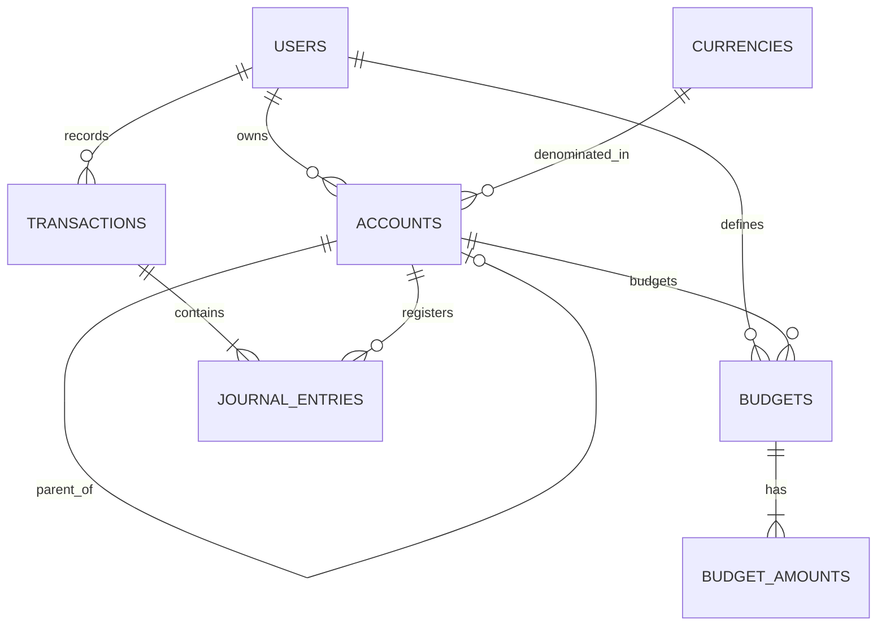

# Data Model Design: Web Accounting App (Sistema Contable)

This document details the database schema and entity relationships for the double-entry accounting web application.

---

## 1. Unified Chart of Accounts (Plan de Cuentas)

To support a strict double-entry model where both financial accounts (cash, bank, card) and categories (comida, salario) participate in transactions, we unify them into a single hierarchical **Accounts** entity.

---

## 2. Table Specifications

### 2.1. `users` (Usuarios)
Stores user credentials and workspace isolation.
- `id` (UUID, Primary Key, Default: `gen_random_uuid()`)
- `email` (VARCHAR, Unique, Not Null)
- `password_hash` (VARCHAR, Not Null)
- `created_at` (TIMESTAMP WITH TIME ZONE, Default: `now()`)

### 2.2. `currencies` (Monedas)
Defines supported currencies and conversion rates.
- `id` (UUID, Primary Key, Default: `gen_random_uuid()`)
- `code` (VARCHAR(3), Unique, Not Null) - e.g., 'PYG', 'USD'
- `name` (VARCHAR, Not Null) - e.g., 'Guaraní Paraguayo', 'Dólar Estadounidense'
- `symbol` (VARCHAR(5), Not Null) - e.g., '₲', '$'
- `rate_to_base` (NUMERIC(18, 4), Not Null, Default: `1.0`) - Conversion factor
- `is_base` (BOOLEAN, Not Null, Default: `false`) - True for base currency (e.g. PYG)
- `decimal_places` (INTEGER, Not Null, Default: `2`)

### 2.3. `accounts` (Cuentas y Categorías)
Unifies assets, liabilities, equity, income, and expenses in a single hierarchy.
- `id` (UUID, Primary Key, Default: `gen_random_uuid()`)
- `user_id` (UUID, Foreign Key referencing `users.id`, Not Null)
- `name` (VARCHAR, Not Null)
- `parent_id` (UUID, Foreign Key referencing `accounts.id`, Nullable) - Enforces 2-level category limit for income/expense
- `type` (VARCHAR(15), Not Null) - ENUM: `'ASSET'`, `'LIABILITY'`, `'EQUITY'`, `'INCOME'`, `'EXPENSE'`
- `currency_id` (UUID, Foreign Key referencing `currencies.id`, Not Null)
- `status` (VARCHAR(10), Not Null, Default: `'ACTIVE'`) - ENUM: `'ACTIVE'`, `'INACTIVE'` (logical delete)
- `metadata` (JSONB, Nullable) - Stores specific fields:
  - For Credit Cards (LIABILITY): `{ "closing_day": 15, "payment_day": 5, "payment_account_id": "uuid" }`
  - For UI display settings: `{ "color": "#ff0000", "order_seq": 10 }`

### 2.4. `transactions` (Asiento Contable Cabecera)
The header of a journal entry.
- `id` (UUID, Primary Key, Default: `gen_random_uuid()`)
- `user_id` (UUID, Foreign Key referencing `users.id`, Not Null)
- `date` (TIMESTAMP WITH TIME ZONE, Not Null)
- `description` (VARCHAR, Not Null) - General memo/notes
- `status` (VARCHAR(10), Not Null, Default: `'POSTED'`) - ENUM: `'POSTED'`, `'REVERSED'` (inmutabilidad)
- `reversal_of_id` (UUID, Foreign Key referencing `transactions.id`, Nullable) - Links a correction to its original transaction
- `created_at` (TIMESTAMP WITH TIME ZONE, Default: `now()`)

### 2.5. `journal_entries` (Apuntes/Detalles)
The individual debit/credit lines of a transaction.
- `id` (UUID, Primary Key, Default: `gen_random_uuid()`)
- `transaction_id` (UUID, Foreign Key referencing `transactions.id`, On Delete Cascade, Not Null)
- `account_id` (UUID, Foreign Key referencing `accounts.id`, Not Null)
- `entry_type` (VARCHAR(6), Not Null) - ENUM: `'DEBIT'` (Debe), `'CREDIT'` (Haber)
- `amount` (NUMERIC(18, 4), Not Null) - Face value in the transaction currency
- `amount_base` (NUMERIC(18, 4), Not Null) - Calculated value in base currency at transaction date
- `rate_at_date` (NUMERIC(18, 4), Not Null) - Exchange rate used for conversion

### 2.6. `budgets` (Presupuestos Cabecera)
Defines a target budget for a given expense or income account.
- `id` (UUID, Primary Key, Default: `gen_random_uuid()`)
- `user_id` (UUID, Foreign Key referencing `users.id`, Not Null)
- `account_id` (UUID, Foreign Key referencing `accounts.id`, Not Null) - Must reference an `'EXPENSE'` or `'INCOME'` account
- `period_type` (VARCHAR(10), Not Null, Default: `'MONTHLY'`) - ENUM: `'MONTHLY'`, `'YEARLY'`
- `status` (VARCHAR(10), Not Null, Default: `'ACTIVE'`) - ENUM: `'ACTIVE'`, `'INACTIVE'`

### 2.7. `budget_amounts` (Límites Mensuales)
Allows overriding budget limits for specific months, or setting a default.
- `id` (UUID, Primary Key, Default: `gen_random_uuid()`)
- `budget_id` (UUID, Foreign Key referencing `budgets.id`, On Delete Cascade, Not Null)
- `amount` (NUMERIC(18, 4), Not Null)
- `period` (INTEGER, Not Null, Default: `0`) - Format: `YYYYMM` (e.g. `202607`), or `0` for default recurrence

---

## 3. Database Integrity & Constraints

1. **Balance Check Constraint**:
   Every transaction MUST satisfy the double-entry equation in the base currency:
   $$\sum \text{amount\_base (where type = DEBIT)} = \sum \text{amount\_base (where type = CREDIT)}$$
   This check is executed at the database level via a trigger or strictly verified at the NestJS service level inside a database transaction (`SERIALIZABLE` isolation).
2. **Logical Deletes**:
   To comply with the append-only ledger rule (Principle I), accounts and categories linked to journal entries cannot be deleted physically. The system sets their status to `'INACTIVE'`.
3. **Credit Card Payments**:
   Credit Card accounts store statement cycles. When paying a card, a transaction is registered:
   - Debit: Card Account (decreases outstanding liability)
   - Credit: Checking/Cash Account (decreases asset)
