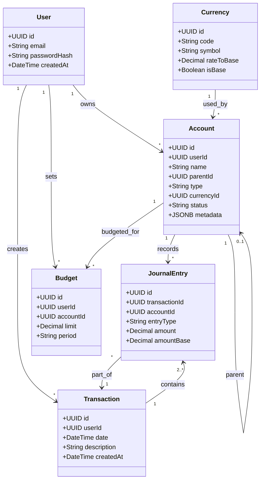

# Data Model: Accounting Dashboard and Core Modules

## Entity Relationships

---

## Entity Details

### 1. Account (Cuenta / Rubro)
- **Database Table**: `accounts`
- **Fields**:
  - `id`: UUID (Primary Key)
  - `userId`: UUID (Foreign Key to users)
  - `name`: VarChar(100) (Unique per user+name combo)
  - `parentId`: UUID (Self-referencing Foreign Key, nullable)
  - `type`: Enum (`ASSET`, `LIABILITY`, `EQUITY`, `INCOME`, `EXPENSE`)
  - `currencyId`: UUID (Foreign Key to currencies)
  - `status`: Enum (`ACTIVE`, `INACTIVE`)
  - `metadata`: JSONB (nullable, containing settings like initial balances)
- **Validation Rules**:
  - `name` cannot be empty.
  - Parent account must be of the same type.
  - Circular parent-child hierarchies are forbidden.

### 2. Transaction (Transacción / Asiento)
- **Database Table**: `transactions`
- **Fields**:
  - `id`: UUID (Primary Key)
  - `userId`: UUID (Foreign Key to users)
  - `date`: DateTime (Date when transaction occurred)
  - `description`: Text (General description/notes)
  - `createdAt`: DateTime
- **Validation Rules**:
  - Must have at least 2 entries (Double-entry rules).

### 3. JournalEntry (Apunte / Línea de Asiento)
- **Database Table**: `journal_entries`
- **Fields**:
  - `id`: UUID (Primary Key)
  - `transactionId`: UUID (Foreign Key to transactions)
  - `accountId`: UUID (Foreign Key to accounts)
  - `entryType`: Enum (`DEBIT`, `CREDIT`)
  - `amount`: Decimal (Transaction currency value)
  - `amountBase`: Decimal (Converted base currency value)
- **Validation Rules**:
  - `amount` must be greater than zero.
  - The sum of all `amountBase` values for DEBIT entries in a transaction must equal the sum of all `amountBase` values for CREDIT entries in that transaction.

### 4. Currency (Moneda)
- **Database Table**: `currencies`
- **Fields**:
  - `id`: UUID (Primary Key)
  - `code`: VarChar(3) (ISO 4217, e.g. "USD", "PYG", "ARS")
  - `symbol`: VarChar(5) (e.g. "$", "Gs", "kr")
  - `rateToBase`: Decimal (Multiplier to convert to primary currency)
  - `isBase`: Boolean (true if primary base currency)
