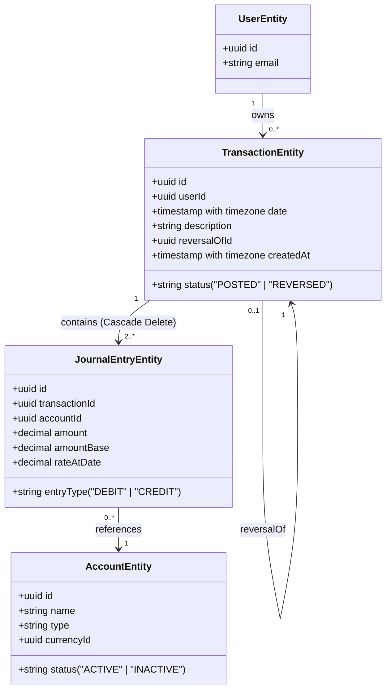
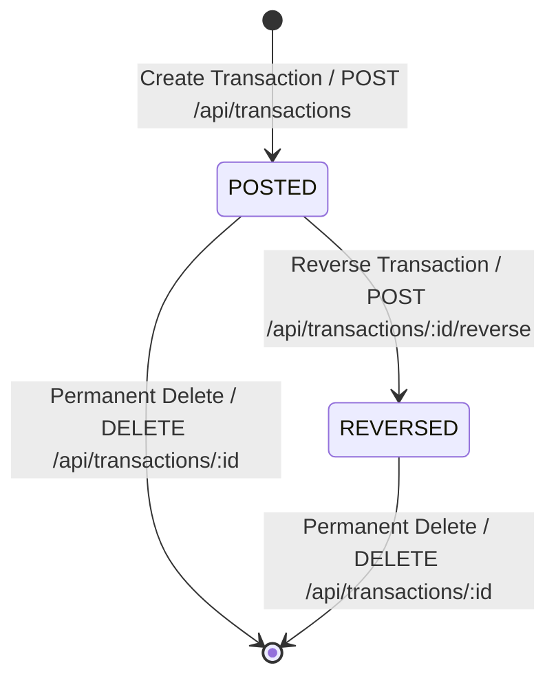

# Data Model: Dedicated Transaction Entry Page & Operations

## Entities

The database tables are mapped as TypeORM entities: `TransactionEntity` and `JournalEntryEntity`.

---

### 1. TransactionEntity (Header)
Represents the journal entry header.

| Field | Type | Description |
|---|---|---|
| `id` | UUID (PK) | Unique identifier for the transaction. |
| `userId` | UUID (FK) | References the `UserEntity` who recorded this entry. |
| `date` | Timestamp | Date and time when the transaction occurred. |
| `description` | String | Explanatory note or concept (Glosa). |
| `status` | String | Either `"POSTED"` or `"REVERSED"`. |
| `reversalOfId` | UUID (FK, Nullable) | References the transaction that this entry reverses. |
| `createdAt` | Timestamp | System timestamp when the record was created. |

---

### 2. JournalEntryEntity (Lines)
Represents individual credit and debit lines.

| Field | Type | Description |
|---|---|---|
| `id` | UUID (PK) | Unique identifier for the journal entry line. |
| `transactionId` | UUID (FK) | References the parent `TransactionEntity`. CASCADE DELETE enabled. |
| `accountId` | UUID (FK) | References the `AccountEntity` affected. |
| `entryType` | String | Either `"DEBIT"` or `"CREDIT"`. |
| `amount` | Decimal | Amount in the account's local currency. |
| `amountBase` | Decimal | Amount converted to the system's base currency using `rateAtDate`. |
| `rateAtDate` | Decimal | Exchange rate from the account currency to base currency at the transaction date. |

---

## State Transitions

### State Behavior
- **POSTED**: Active transaction. It can be modified (`PUT /api/transactions/:id`), reversed, or permanently deleted.
- **REVERSED**: The transaction has been offset by a reversal transaction. It cannot be modified (`PUT /api/transactions/:id`). However, it can be permanently deleted.
- **REVERSAL TRANSACTION** (a transaction with a non-null `reversalOfId`): Implies it was generated automatically to offset an error. It cannot be edited.

---

## Validation Rules

1. **Balance Check (Double-Entry Constraint)**:
   $$\sum \text{AmountBase(DEBIT)} = \sum \text{AmountBase(CREDIT)}$$
   With a floating-point tolerance of $0.0001$.
2. **Minimum Lines**: A transaction must contain at least two entries (one debit and one credit).
3. **Valid Accounts**: Each account referred to in the entry lines must exist, belong to the current user, and be active (`status === 'ACTIVE'`).
4. **Positive Amounts**: Every line amount must be greater than zero.
