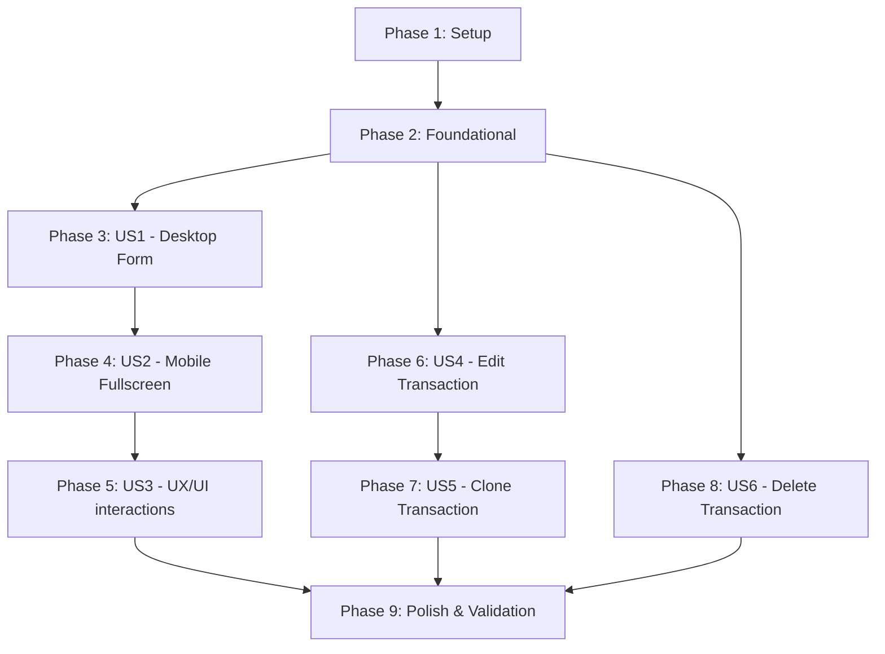

# Tasks: Dedicated Transaction Entry Page & Operations

**Input**: Design documents from `/specs/010-dedicated-transaction-page/`

**Prerequisites**: [plan.md](file:///Users/ale/dev/sistema-contable/specs/010-dedicated-transaction-page/plan.md), [spec.md](file:///Users/ale/dev/sistema-contable/specs/010-dedicated-transaction-page/spec.md), [research.md](file:///Users/ale/dev/sistema-contable/specs/010-dedicated-transaction-page/research.md), [data-model.md](file:///Users/ale/dev/sistema-contable/specs/010-dedicated-transaction-page/data-model.md)

**Tests**: Test-Driven Development (TDD) is mandated by the project Constitution (Principle V). Backend test tasks are included and must be written/verified first.

---

## Phase 1: Setup (Shared Infrastructure)

**Purpose**: Core model/type registration and client/server routing baseline setup

- [x] T001 [P] Register and export transaction update DTO schemas in [shared/src/index.ts](file:///Users/ale/dev/sistema-contable/shared/src/index.ts)
- [x] T002 [P] Register placeholder controller route handlers for `GET :id`, `PUT :id`, and `DELETE :id` in [backend/src/infrastructure/controllers/ledger.controller.ts](file:///Users/ale/dev/sistema-contable/backend/src/infrastructure/controllers/ledger.controller.ts)
- [x] T003 [P] Add api transaction wrappers for single transaction retrieve, edit, and delete in [frontend/src/services/api.ts](file:///Users/ale/dev/sistema-contable/frontend/src/services/api.ts)

---

## Phase 2: Foundational (Blocking Prerequisites)

**Purpose**: Utilities and layout configurations required before user story pages can be successfully rendered and routed

- [x] T004 [P] Implement timezone offset formatter helper `formatLocalDateTimeWithOffset` in [frontend/src/lib/utils.ts](file:///Users/ale/dev/sistema-contable/frontend/src/lib/utils.ts)
- [x] T005 Setup responsive layout rules in [frontend/src/components/MainLayout.tsx](file:///Users/ale/dev/sistema-contable/frontend/src/components/MainLayout.tsx) to hide standard sidebar, headers, and footer navigations on mobile for the dedicated entry route

---

## Phase 3: User Story 1 - Dedicated Desktop Transaction Screen (Priority: P1) 🎯 MVP

**Goal**: Implement the basic full-screen route `/transactions/new` on desktop with manual row additions and form submissions

**Independent Test**: Navigate to `/transactions/new` on desktop, fill out a balanced transaction (Glosa, Date, 2 items), and click Save to successfully persist and return to lists.

### Implementation for User Story 1
- [x] T006 [P] [US1] Create full-page container structure and desktop sidebar layout in [frontend/src/app/transactions/new/page.tsx](file:///Users/ale/dev/sistema-contable/frontend/src/app/transactions/new/page.tsx)
- [x] T007 [P] [US1] Create form header, concept inputs, and datetime local selection in [frontend/src/app/transactions/new/page.tsx](file:///Users/ale/dev/sistema-contable/frontend/src/app/transactions/new/page.tsx)
- [x] T008 [US1] Implement wide table row loop supporting Debits, Credits, and basic account selection dropdowns in [frontend/src/app/transactions/new/page.tsx](file:///Users/ale/dev/sistema-contable/frontend/src/app/transactions/new/page.tsx)
- [x] T009 [US1] Modify [frontend/src/components/Sidebar.tsx](file:///Users/ale/dev/sistema-contable/frontend/src/components/Sidebar.tsx) and [frontend/src/components/FloatingActionButton.tsx](file:///Users/ale/dev/sistema-contable/frontend/src/components/FloatingActionButton.tsx) to redirect to `/transactions/new` instead of triggering the old modal

---

## Phase 4: User Story 2 - Fullscreen Mobile Form Experience (Priority: P1)

**Goal**: Optimize the dedicated page viewports and input row components specifically for mobile screens

**Independent Test**: Resize the browser to mobile viewport (< 640px) or navigate to `/transactions/new` on mobile. Verify standard sidebars/footers are hidden, and entry rows render in stacked layout.

### Implementation for User Story 2
- [x] T010 [P] [US2] Design touch-friendly stacked design or high-density vertical layout for entry rows in [frontend/src/app/transactions/new/page.tsx](file:///Users/ale/dev/sistema-contable/frontend/src/app/transactions/new/page.tsx)
- [x] T011 [US2] Implement a sticky footer summary panel containing totals (Debe / Haber) and submit triggers in [frontend/src/app/transactions/new/page.tsx](file:///Users/ale/dev/sistema-contable/frontend/src/app/transactions/new/page.tsx)

---

## Phase 5: User Story 3 - Exquisite UX/UI & Micro-interactions (Priority: P2)

**Goal**: Provide autocomplete account queries, smart input autofill behaviors, and navigation warning prompts

**Independent Test**: Create an unbalanced line (e.g. DEBIT 100), click "Agregar Apunte", and verify a CREDIT row is created with amount `100` auto-populated. Try to navigate back and confirm that the browser prompts for unsaved changes confirmation.

### Implementation for User Story 3
- [x] T012 [US3] Add balance-detection triggers to auto-calculate difference and pre-fill opposite entry types when adding rows in [frontend/src/app/transactions/new/page.tsx](file:///Users/ale/dev/sistema-contable/frontend/src/app/transactions/new/page.tsx)
- [x] T013 [P] [US3] Refactor entry rows account selector to use searchable combobox layout with grouping in [frontend/src/components/JournalEntryRow.tsx](file:///Users/ale/dev/sistema-contable/frontend/src/components/JournalEntryRow.tsx)
- [x] T014 [P] [US3] Implement browser `beforeunload` event handler and state triggers to prevent accidental navigation data loss in [frontend/src/app/transactions/new/page.tsx](file:///Users/ale/dev/sistema-contable/frontend/src/app/transactions/new/page.tsx)

---

## Phase 6: User Story 4 - Editing Existing Transactions (Priority: P2)

**Goal**: Retrieve transaction details, edit balances, replace journal entries, and restrict edits to reversed logs

**Independent Test**: Click edit on an existing transaction card, verify it loads at `/transactions/new?edit=<id>`. Save edits and verify changes reflect on database. Ensure reversed transactions disable/hide editing.

### Tests for User Story 4
- [x] T015 [P] [US4] Write integration test cases for `UpdateTransactionUseCase` in [backend/tests/integration/update-transaction.spec.ts](file:///Users/ale/dev/sistema-contable/backend/tests/integration/update-transaction.spec.ts)

### Implementation for User Story 4
- [x] T016 [US4] Implement transactional logic in `UpdateTransactionUseCase` inside [backend/src/application/ledger/update-transaction.use-case.ts](file:///Users/ale/dev/sistema-contable/backend/src/application/ledger/update-transaction.use-case.ts)
- [x] T017 [US4] Bind new update providers and export dependencies in [backend/src/infrastructure/ledger/ledger.module.ts](file:///Users/ale/dev/sistema-contable/backend/src/infrastructure/ledger/ledger.module.ts)
- [x] T018 [US4] Connect `GET :id` and `PUT :id` use cases inside controller handlers in [backend/src/infrastructure/controllers/ledger.controller.ts](file:///Users/ale/dev/sistema-contable/backend/src/infrastructure/controllers/ledger.controller.ts)
- [x] T019 [US4] Implement edit state detection, transaction fetching, and save modifications in [frontend/src/app/transactions/new/page.tsx](file:///Users/ale/dev/sistema-contable/frontend/src/app/transactions/new/page.tsx)
- [x] T020 [P] [US4] Disable editing triggers for reversed or reversal transactions in transaction lists in [frontend/src/app/transactions/page.tsx](file:///Users/ale/dev/sistema-contable/frontend/src/app/transactions/page.tsx)

---

## Phase 7: User Story 5 - Copying/Duplicating Transactions (Priority: P2)

**Goal**: Load details of an existing transaction, reset the date to current, and save as a new transaction

**Independent Test**: Click duplicate/copy on a transaction, verify it opens `/transactions/new?cloneFrom=<id>` with date initialized to today. Save it and verify a new transaction is created without changing the source.

### Implementation for User Story 5
- [x] T021 [US5] Implement clone state detection, transaction fetching, and reset of date inputs in [frontend/src/app/transactions/new/page.tsx](file:///Users/ale/dev/sistema-contable/frontend/src/app/transactions/new/page.tsx)

---

## Phase 8: User Story 6 - Permanent Deletion (Priority: P2)

**Goal**: Delete a transaction permanently from the ledger and require explicit user validation dialogs

**Independent Test**: Click delete on a transaction card, verify validation confirmation overlay, and verify it is removed from lists.

### Tests for User Story 6
- [x] T022 [P] [US6] Write integration test cases for `DeleteTransactionUseCase` in [backend/tests/integration/delete-transaction.spec.ts](file:///Users/ale/dev/sistema-contable/backend/tests/integration/delete-transaction.spec.ts)

### Implementation for User Story 6
- [x] T023 [US6] Implement deletion logic in `DeleteTransactionUseCase` inside [backend/src/application/ledger/delete-transaction.use-case.ts](file:///Users/ale/dev/sistema-contable/backend/src/application/ledger/delete-transaction.use-case.ts)
- [x] T024 [US6] Bind deletion provider and export configurations in [backend/src/infrastructure/ledger/ledger.module.ts](file:///Users/ale/dev/sistema-contable/backend/src/infrastructure/ledger/ledger.module.ts)
- [x] T025 [US6] Connect `DELETE :id` use cases inside controller handlers in [backend/src/infrastructure/controllers/ledger.controller.ts](file:///Users/ale/dev/sistema-contable/backend/src/infrastructure/controllers/ledger.controller.ts)
- [x] T026 [US6] Implement custom delete buttons, confirmation modal overlays, and list refresh logic in [frontend/src/app/transactions/page.tsx](file:///Users/ale/dev/sistema-contable/frontend/src/app/transactions/page.tsx)

---

## Phase 9: Polish & Cross-Cutting Concerns

**Purpose**: Validation, testing execution, lint compliance check, and walkthrough reporting

- [x] T027 [P] Run backend and frontend code quality checks (ESLint, Prettier)
- [x] T028 Run backend and frontend test suites to ensure 100% test passing
- [x] T029 Execute full manual validation workflow per [quickstart.md](file:///Users/ale/dev/sistema-contable/specs/010-dedicated-transaction-page/quickstart.md) and record visual/walkthrough notes in `walkthrough.md`

---

## Dependencies & Execution Order

### Phase Dependencies

### Parallel Opportunities
- **Phase 1 (Setup)**: Tasks T001, T002, T003 can be run in parallel.
- **Phase 6 (Edit Mode)**: Test task T015 can be written in parallel with T020.
- **Phase 8 (Delete)**: Test task T022 can be written in parallel with T026.
- Once Phase 2 (Foundational) is complete, development on **US1/US2/US3 (Entry Screen)**, **US4/US5 (Edit/Clone Operations)**, and **US6 (Deletion)** can proceed in parallel since they touch different parts of the frontend code and separate backend providers.

---

## Implementation Strategy

### MVP Scope (User Story 1 Only)
1. Complete Setup (Phase 1) and Foundational Layout rules (Phase 2).
2. Create dedicated desktop entry page `/transactions/new` (T006-T009).
3. Validate manually that user can save a balanced transaction and see it in the list.

### Incremental Delivery
1. Add mobile view rules and stack styles (US2).
2. Implement smart autofill and combobox account autocomplete (US3).
3. Implement backend update logic + edit page forms (US4).
4. Implement cloning modes (US5).
5. Implement backend and frontend deletions (US6).
6. Run full verification and polish styles (Phase 9).

---

## Phase 10: Convergence

- [x] T030 [P] Replace `openTransactionModal` call with `router.push('/transactions/new')` (or `<Link>`) in the "Agregar Transacción" button inside [frontend/src/app/transactions/page.tsx](file:///Users/ale/dev/sistema-contable/frontend/src/app/transactions/page.tsx) per FR-050, US1/AC1 (contradicts)
- [x] T031 [P] Remove `TransactionModal` import and `isTransactionModalOpen`/`closeTransactionModal` usage from [frontend/src/components/MainLayout.tsx](file:///Users/ale/dev/sistema-contable/frontend/src/components/MainLayout.tsx) — the modal is replaced by the dedicated route per FR-050 (contradicts)
- [x] T032 Rework `<Header />` visibility in [frontend/src/components/MainLayout.tsx](file:///Users/ale/dev/sistema-contable/frontend/src/components/MainLayout.tsx) so it is hidden on ALL viewports (not just mobile) when on `/transactions/new`, eliminating the double-header on desktop per FR-002, US1 (contradicts)
- [x] T033 Fix the TransactionForm root layout in [frontend/src/app/transactions/new/page.tsx](file:///Users/ale/dev/sistema-contable/frontend/src/app/transactions/new/page.tsx) to integrate properly with the desktop MainLayout flex context — remove standalone `h-screen` from the root div and use flex-grow instead so the sidebar remains visible and the page fills only the available main-content area on desktop, per FR-002, US1 (contradicts)

---

## Phase 11: Convergence

- [x] T034 [P] Remove stale `useModal` import and `openTransactionModal` destructure from [frontend/src/components/Sidebar.tsx](file:///Users/ale/dev/sistema-contable/frontend/src/components/Sidebar.tsx) — modal pattern is decommissioned per FR-050 (contradicts)
- [x] T035 Change sidebar breakpoint from `hidden lg:flex` to `hidden sm:flex` in [frontend/src/components/Sidebar.tsx](file:///Users/ale/dev/sistema-contable/frontend/src/components/Sidebar.tsx) so the sidebar is visible at ≥640px (desktop per spec) rather than ≥1024px, aligning with FR-002/FR-003 that define desktop as ≥640px and mobile as <640px (partial)
- [x] T036 [P] Add entry-mount animation (fade-in / slide-in) to journal entry rows in [frontend/src/app/transactions/new/page.tsx](file:///Users/ale/dev/sistema-contable/frontend/src/app/transactions/new/page.tsx) when rows are added, per US3/AC2 (partial)
- [x] T037 [P] Add a `CheckCircle2` icon next to the difference value and a smooth color-transition animation in the sticky footer balance indicator in [frontend/src/app/transactions/new/page.tsx](file:///Users/ale/dev/sistema-contable/frontend/src/app/transactions/new/page.tsx) when the transaction becomes balanced, per US3/AC3 (partial)
