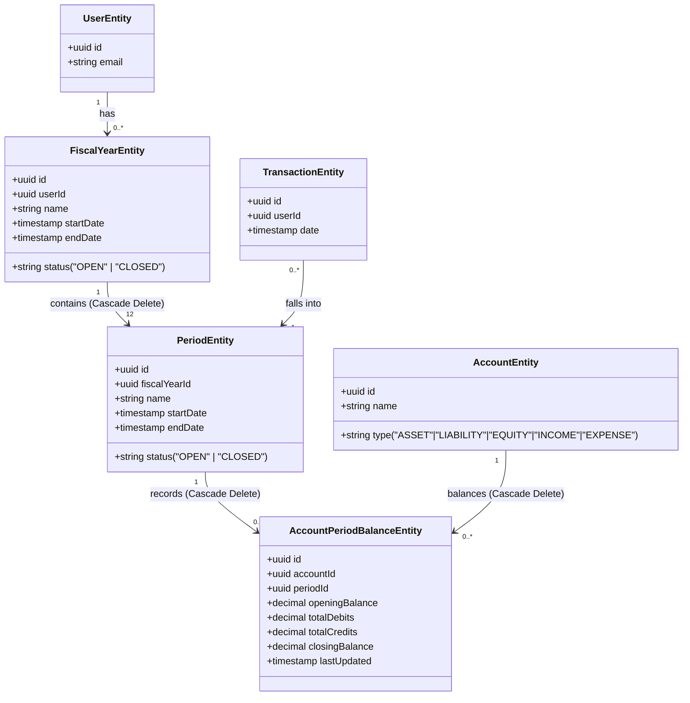
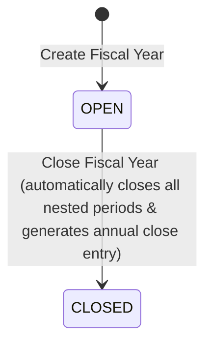

# Data Model: Accounting Balances and Period Tracking Engine

This document details the database models, relations, state transitions, and core calculations.

## Entity Relationships

The schema introduces `FiscalYearEntity`, `PeriodEntity`, and `AccountPeriodBalanceEntity`, which coordinate with the existing `UserEntity`, `AccountEntity`, and `TransactionEntity`.

---

## Entity Details

### 1. FiscalYearEntity
Represents a complete financial year.

| Field | Type | Constraints | Description |
|---|---|---|---|
| `id` | UUID | PK | Unique identifier. |
| `userId` | UUID | FK | Reference to `UserEntity`. |
| `name` | VARCHAR | UNIQUE(userId, name) | e.g. `"2026"`. |
| `startDate` | Timestamp TZ | NOT NULL | Fiscal year start date. |
| `endDate` | Timestamp TZ | NOT NULL | Fiscal year end date. |
| `status` | VARCHAR | DEFAULT `"OPEN"` | `"OPEN"` or `"CLOSED"`. |

---

### 2. PeriodEntity
Represents a monthly accounting period nested in a fiscal year.

| Field | Type | Constraints | Description |
|---|---|---|---|
| `id` | UUID | PK | Unique identifier. |
| `fiscalYearId` | UUID | FK | References `FiscalYearEntity`. Cascade Delete. |
| `name` | VARCHAR | UNIQUE(fiscalYearId, name) | e.g. `"2026-03"`. |
| `startDate` | Timestamp TZ | NOT NULL | Period start date (inclusive). |
| `endDate` | Timestamp TZ | NOT NULL | Period end date (inclusive). |
| `status` | VARCHAR | DEFAULT `"OPEN"` | `"OPEN"` or `"CLOSED"`. |

---

### 3. AccountPeriodBalanceEntity
Maintains the performance aggregates per account per period.

| Field | Type | Constraints | Description |
|---|---|---|---|
| `id` | UUID | PK | Unique identifier. |
| `accountId` | UUID | FK | References `AccountEntity`. Cascade Delete. |
| `periodId` | UUID | FK | References `PeriodEntity`. Cascade Delete. |
| `openingBalance` | Decimal(18,4) | DEFAULT `0.0000` | Opening balance in system base currency. |
| `totalDebits` | Decimal(18,4) | DEFAULT `0.0000` | Incremental sum of debits inside this period. |
| `totalCredits` | Decimal(18,4) | DEFAULT `0.0000` | Incremental sum of credits inside this period. |
| `closingBalance` | Decimal(18,4) | DEFAULT `0.0000` | Final balance in system base currency. |
| `lastUpdated` | Timestamp TZ | DEFAULT `now()` | Timestamp of last modification. |

- **Constraint**: Unique index on `(accountId, periodId)`.

---

## State Transitions

### A. Fiscal Year State

### B. Period State

```mermaid
stateDiagram-v2
    [*] --> OPEN : Automatically created in OPEN state
    OPEN --> CLOSED : Close Period (blocks transaction changes; done when fiscal year is closed or via API)
    CLOSED --> OPEN : Reopen Period (triggers recalculation propagation)
```

---

## Core Validation & Calculation Rules

### 1. Account Balance Formula
The closing balance is computed depending on the account type:
- **Debit Nature (Asset, Expense)**:
  $$\text{Closing Balance} = \text{Opening Balance} + \text{Total Debits} - \text{Total Credits}$$
- **Credit Nature (Liability, Equity, Income)**:
  $$\text{Closing Balance} = \text{Opening Balance} + \text{Total Credits} - \text{Total Debits}$$

### 2. Period Locking Rule
All write endpoints for transactions (`POST /api/transactions`, `PUT /api/transactions/:id`, `DELETE /api/transactions/:id`, `POST /api/transactions/:id/reverse`) must validate:
$$\text{Period}(\text{tx.date}) \rightarrow \text{status} \neq \text{"CLOSED"}$$

If a transaction's date belongs to a closed period, the backend rejects it with `400 Bad Request`.
For an update, if a transaction is moved from an open period to a closed period, or vice versa, the transaction is rejected.
For deletion, if the transaction is in a closed period, it is rejected.
For reversal, if the original transaction date is in a closed period, the reversal must be posted in an *open* period.

### 3. Annual closing rules
To close a Fiscal Year:
- The year must be currently `'OPEN'`.
- Upon execution, the system automatically sets the status of all 12 nested periods to `'CLOSED'`.
- A transaction on the last moment of the fiscal year (e.g. `12-31T23:59:59.999Z`) balances all `INCOME` and `EXPENSE` accounts to `0`, and posts the difference to `Retained Earnings`.
- Closing balances of `ASSET`, `LIABILITY`, `EQUITY` carry forward to the opening balance of the next year's first period.
- Opening balances of `INCOME` and `EXPENSE` in the next year's first period are set to `0`.

