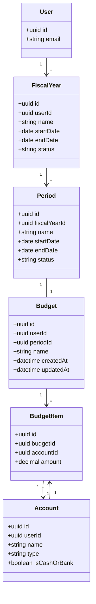

# Data Model: Presupuestos Financieros y Proyecciones de Caja

## 1. Modified Entities

### Account (`accounts` table)
- Added attribute `isCashOrBank: boolean` (name in database: `is_cash_or_bank`), type `boolean`, default `false`.
- Validation: Block updates to `isCashOrBank` if there are any `JournalEntry` rows pointing to the account.

### Budget (`budgets` table)
Refactored schema:
- `id`: UUID, Primary Key.
- `userId`: UUID, Foreign Key to `users`.
- `periodId`: UUID, Unique Foreign Key to `periods` (name in database: `period_id`).
- `name`: Varchar, friendly identifier (e.g. "Enero 2026").
- `createdAt`: Timestamp with time zone.
- `updatedAt`: Timestamp with time zone.

Relationships:
- 1-to-1 with `PeriodEntity`.
- 1-to-Many with `BudgetItemEntity`.

---

## 2. New Entities

### BudgetItem (`budget_items` table)
- `id`: UUID, Primary Key.
- `budgetId`: UUID, Foreign Key to `budgets` (cascade delete on delete of budget).
- `accountId`: UUID, Foreign Key to `accounts` (cascade delete on delete of account).
- `amount`: Decimal (18, 4), representing the budgeted limit or expected amount. Can be positive or negative.

Indexes/Constraints:
- Unique Index on `[budgetId, accountId]` to guarantee that an account is only budgeted once per period.

---

## 3. Data Model Diagram (Mermaid)

