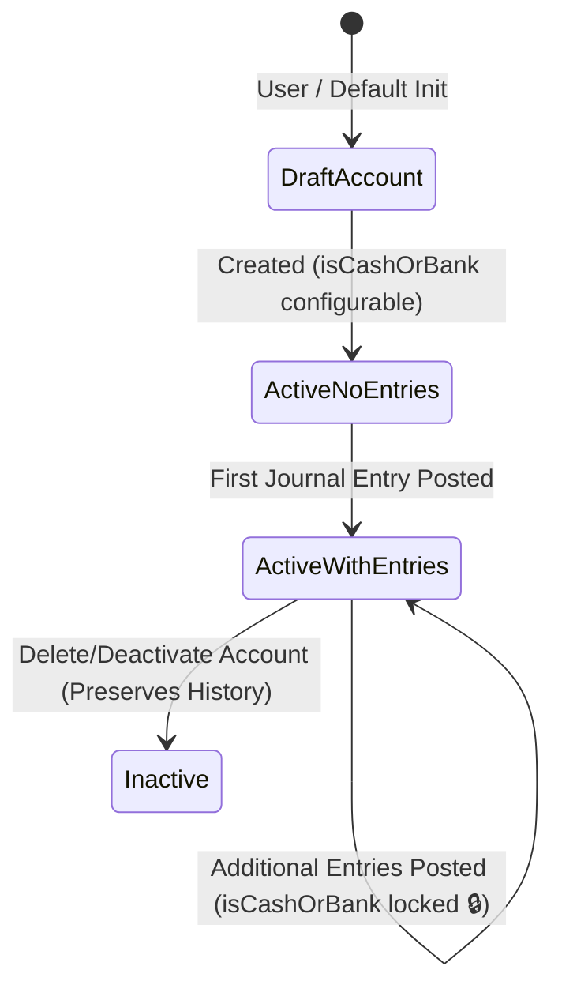

# Phase 1 Data Model: Treasury Cash Accounts & Cash Flow Refactor

## Key Entities & Schema Specifications

### 1. Account Entity (`AccountEntity`)

Represents a financial account in the chart of accounts (Plan de Cuentas).

| Attribute | Type | Constraints | Description |
| :--- | :--- | :--- | :--- |
| `id` | UUID | Primary Key, Generated | Unique account identifier |
| `userId` | UUID | Foreign Key -> User, Indexed | Account owner ID |
| `name` | String(100) | Required | Name of the account (e.g., "Efectivo", "Banco Itaú", "Comida") |
| `type` | Enum | `ASSET`, `LIABILITY`, `EQUITY`, `INCOME`, `EXPENSE` | Financial classification |
| `isCashOrBank` | Boolean | Default: `false` | Liquidity flag: `true` if cash/bank/money account |
| `currencyId` | UUID | Foreign Key -> Currency | Account currency |
| `parentId` | UUID | Optional, Foreign Key -> Account | Parent account ID for hierarchy |
| `status` | Enum | `ACTIVE`, `INACTIVE` | Account lifecycle status |
| `createdAt` | Timestamp | Generated | Creation timestamp |
| `updatedAt` | Timestamp | Generated | Last modification timestamp |

#### Validation Rules:
- **Default Money Accounts**: Initial accounts named `Efectivo` and `Cuenta Bancaria` must be created with `isCashOrBank = true`.
- **Immutability Constraint**: If `count(JournalEntryEntity where accountId = id) > 0`, mutating `isCashOrBank` is strictly forbidden. Any update request attempting to flip `isCashOrBank` when journal entries exist MUST throw `BadRequestException`.

---

### 2. Account Period Balance Entity (`AccountPeriodBalanceEntity`)

Pre-aggregated period balances used for instantaneous reporting.

| Attribute | Type | Constraints | Description |
| :--- | :--- | :--- | :--- |
| `id` | UUID | Primary Key | Unique balance record ID |
| `accountId` | UUID | Foreign Key -> Account, Indexed | Reference account |
| `periodId` | UUID | Foreign Key -> AccountingPeriod, Indexed | Accounting period |
| `openingBalance` | Decimal(15, 2) | Default: `0.00` | Starting period balance |
| `debitSum` | Decimal(15, 2) | Default: `0.00` | Total debit entries in period |
| `creditSum` | Decimal(15, 2) | Default: `0.00` | Total credit entries in period |
| `closingBalance` | Decimal(15, 2) | Default: `0.00` | Ending period balance (`openingBalance + debits - credits` or vice versa by account type) |

#### Cash Flow Aggregation Rules:
- Accounts with `isCashOrBank = true` contribute to `openingCashBalance`, `closingCashBalance`, and `netCashFlow`.
- Accounts with `isCashOrBank = false` contribute to the non-liquid line item breakdown grouped by parent category and account name.

---

### 3. State Transitions & Rules

