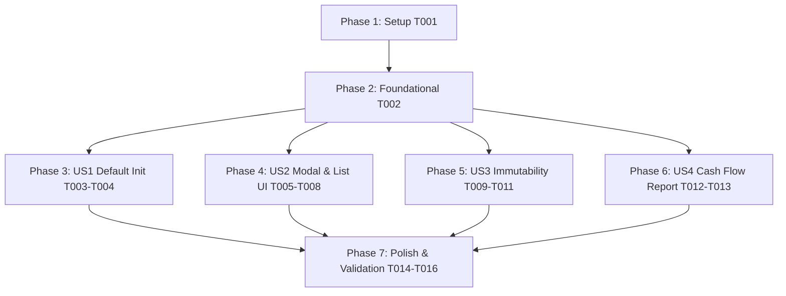

# Tasks: Treasury Cash Accounts and Cash Flow Refactor

**Input**: Design documents from `/specs/014-treasury-cash-flow-refactor/`

**Prerequisites**: [plan.md](./plan.md) (required), [spec.md](./spec.md) (required), [research.md](./research.md), [data-model.md](./data-model.md), [contracts/](./contracts/)

**Organization**: Tasks are grouped by user story to enable independent implementation and testing of each story in accordance with Test-Driven Development (TDD).

## Format: `[ID] [P?] [Story] Description`

- **[P]**: Can run in parallel (different files, no dependencies)
- **[Story]**: Which user story this task belongs to (e.g., US1, US2, US3, US4)

---

## Phase 1: Setup (Shared Infrastructure)

**Purpose**: Monorepo verification and environment preparation

- [x] T001 Verify project build scripts and test runners in `backend/package.json` and `frontend/package.json`

---

## Phase 2: Foundational (Blocking Prerequisites)

**Purpose**: Core entity and database mapping verification

**⚠️ CRITICAL**: No user story work can begin until this phase is complete

- [x] T002 Verify `AccountEntity` and `AccountPeriodBalanceEntity` definitions in `backend/src/infrastructure/database/entities/account.entity.ts` and `backend/src/infrastructure/database/entities/account-period-balance.entity.ts`

**Checkpoint**: Foundation ready - user story implementation can now begin

---

## Phase 3: User Story 1 - Default Money Accounts Initialization (Priority: P1) 🎯 MVP

**Goal**: Automatically set `isCashOrBank = true` on default Cash and Bank accounts generated during system initialization.

**Independent Test**: Execute default account creation and assert that `Efectivo` and `Cuenta Bancaria` have `isCashOrBank = true`.

### Tests for User Story 1

- [x] T003 [P] [US1] Write unit test for default account creation with `isCashOrBank: true` in `frontend/src/tests/accounts-default.test.tsx`

### Implementation for User Story 1

- [x] T004 [US1] Update `handleCreateDefaultAccounts` in `frontend/src/app/accounts/page.tsx` to set `isCashOrBank: true` for default Cash (`Efectivo`) and Bank (`Cuenta Bancaria`) accounts

**Checkpoint**: User Story 1 complete and independently testable (MVP ready!)

---

## Phase 4: User Story 2 - Account Creation and Editing Modal (Priority: P1)

**Goal**: Provide a clean form toggle in `AccountModal.tsx` for liquid accounts with auto-selection on keyword matches, and display `Caja/Banco` badges in `AccountsList.tsx` instead of inline table checkboxes.

**Independent Test**: Open creation modal, select Asset type, type `Caja Central`, verify toggle auto-selects to `true`. Save and verify badge in accounts list.

### Tests for User Story 2

- [x] T005 [P] [US2] Write unit test for `AccountModal` liquidity toggle and keyword auto-detection in `frontend/src/tests/AccountModal.test.tsx`
- [x] T006 [P] [US2] Write unit test for `AccountsList` rendering `Caja/Banco` badge without inline checkbox in `frontend/src/tests/AccountsList.test.tsx`

### Implementation for User Story 2

- [x] T007 [US2] Update `AccountModal.tsx` in `frontend/src/components/AccountModal.tsx` to add `isCashOrBank` form toggle for Asset accounts with keyword auto-detection (`Efectivo`, `Caja`, `Banco`, `MP`)
- [x] T008 [US2] Update `AccountsList.tsx` in `frontend/src/components/AccountsList.tsx` to remove inline `"Líquido"` checkbox and render `Caja/Banco` status badge

**Checkpoint**: User Story 2 complete and independently testable alongside User Story 1

---

## Phase 5: User Story 3 - Liquidity Flag Immutability (Priority: P2)

**Goal**: Enforce `isCashOrBank` immutability when accounts have posted journal entries, locking the modal toggle in UI and throwing HTTP 400 `BadRequestException` in backend API.

**Independent Test**: Submit a `PATCH` request altering `isCashOrBank` on an account with journal entries and assert HTTP 400 response.

### Tests for User Story 3

- [x] T009 [P] [US3] Write unit test for `UpdateAccountUseCase` immutability validation in `backend/src/application/accounts/update-account.use-case.spec.ts`

### Implementation for User Story 3

- [x] T010 [US3] Ensure `UpdateAccountUseCase` in `backend/src/application/accounts/update-account.use-case.ts` rejects `isCashOrBank` updates with `BadRequestException` when journal entries exist
- [x] T011 [US3] Update `AccountModal.tsx` in `frontend/src/components/AccountModal.tsx` to disable and lock `isCashOrBank` toggle when editing an account with posted transactions

**Checkpoint**: User Story 3 complete and independently testable

---

## Phase 6: User Story 4 - High-Performance Direct Cash Flow Report (Priority: P1)

**Goal**: Optimize Direct Cash Flow calculation via `AccountPeriodBalanceEntity`, isolating liquid cash balances from non-liquid category breakdowns.

**Independent Test**: Generate Cash Flow report across multiple periods and verify opening/closing cash balances and category breakdowns.

### Tests for User Story 4

- [x] T012 [P] [US4] Write integration test for `GetCashFlowUseCase` period balance aggregations in `backend/src/application/reports/get-cash-flow.use-case.spec.ts`

### Implementation for User Story 4

- [x] T013 [US4] Verify and refine `GetCashFlowUseCase` in `backend/src/application/reports/get-cash-flow.use-case.ts` using `AccountPeriodBalanceEntity` to separate liquid cash movement lines from non-liquid category breakdowns

**Checkpoint**: All user stories functional and testable

---

## Phase 7: Polish & Cross-Cutting Concerns

**Purpose**: Quality verification, formatting compliance, and end-to-end testing

- [x] T014 [P] Run linter compliance across backend (`cd backend && npm run lint`) and frontend (`cd frontend && npm run lint`)
- [x] T015 Run complete automated test suite across backend (`cd backend && npm test`) and frontend (`cd frontend && npm test`)
- [x] T016 Perform end-to-end quickstart validation per `quickstart.md` in `specs/014-treasury-cash-flow-refactor/quickstart.md`

---

## Dependencies & Execution Order

---

## Parallel Execution Opportunities

- **Phase 3 & 4 Tests**: `T003` [US1], `T005` [US2], `T006` [US2] can be written in parallel.
- **Phase 5 & 6 Tests**: `T009` [US3], `T012` [US4] can be written in parallel.
- **Polish Phase**: `T014` (Linting) can run in parallel with unit test suite runs.

---

## Implementation Strategy

### MVP First (User Story 1 Only)
1. Complete Setup & Foundational (`T001` - `T002`).
2. Implement User Story 1 (`T003` - `T004`).
3. Validate default cash accounts are created as money accounts (`isCashOrBank = true`).

### Incremental Delivery
1. Deliver US1 (Default Accounts Initialization).
2. Deliver US2 (Modal Toggle & Table Badging).
3. Deliver US3 (Backend & UI Immutability).
4. Deliver US4 (Direct Cash Flow Period Balance Engine).
5. Run full test suite & quickstart verification.
