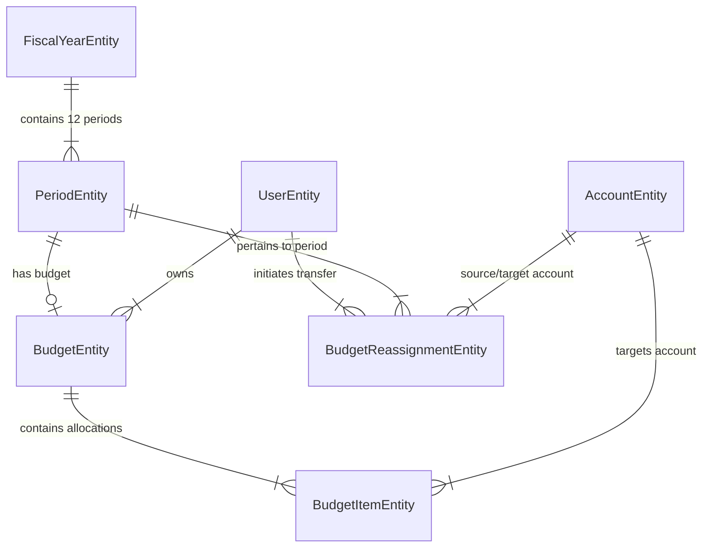

# Data Model: Budget Planning Matrix & Execution Control UX

**Branch**: `017-budget-planning-ux` | **Date**: 2026-08-13 | **Spec**: [spec.md](file:///C:/Users/amend/.gemini/antigravity/worktrees/sistema-contable/redesign_budget_planning_ux/specs/017-budget-planning-ux/spec.md)

---

## Entity Schema & Relationships



---

## 1. BudgetEntity (`budgets`)

Represents the container for monthly budget allocations linked to a specific user and accounting period.

| Field       | Type      | Attributes          | Description                       |
| :---------- | :-------- | :------------------ | :-------------------------------- |
| `id`        | UUID      | Primary Key         | Unique budget identifier          |
| `userId`    | UUID      | Foreign Key         | Owner user ID                     |
| `periodId`  | UUID      | Foreign Key, Unique | Linked period ID                  |
| `name`      | String    | Not Null            | Display name (e.g. "Agosto 2026") |
| `createdAt` | Timestamp | Auto                | Creation timestamp                |
| `updatedAt` | Timestamp | Auto                | Last modification timestamp       |

---

## 2. BudgetItemEntity (`budget_items`)

Represents individual account budget allocations or dynamic cash movement rows.

| Field               | Type          | Attributes          | Description                                                                                          |
| :------------------ | :------------ | :------------------ | :--------------------------------------------------------------------------------------------------- |
| `id`                | UUID          | Primary Key         | Unique item identifier                                                                               |
| `budgetId`          | UUID          | Foreign Key         | Parent budget container ID                                                                           |
| `accountId`         | UUID          | Foreign Key         | Target account ID                                                                                    |
| `subRowId`          | String        | Nullable            | Optional unique identifier for multiple rows of the same account (e.g. loan disbursement vs payment) |
| `subRowLabel`       | String        | Nullable            | Custom label for balance movements (e.g. "Aporte Fondo Indexado", "Pago Cuota Préstamo")             |
| `amount`            | Decimal(18,4) | Not Null, Default 0 | Allocated budget amount                                                                              |
| `cashFlowDirection` | Enum          | Nullable            | `INGRESO_EFECTIVO` (+ Cash Inflow) or `EGRESO_EFECTIVO` (- Cash Outflow)                             |

### Constraints & Financial Blocks Mapping

1. 🟢 **INGRESOS (`INGRESOS`)**:
   - Accounts of type `REVENUE` (or `INCOME`).
   - Automatically pre-populated for active accounts.
   - Cash flow direction: `INGRESO_EFECTIVO` (`+`).
   - Imputable children editable; parent categories display calculated read-only subtotals.
2. 🔴 **GASTOS DE VIDA (`GASTOS_VIDA`)**:
   - Accounts of type `EXPENSE`.
   - Automatically pre-populated for active accounts.
   - Cash flow direction: `EGRESO_EFECTIVO` (`-`).
   - Imputable children editable; parent categories display calculated read-only subtotals.
3. 🔵 **AHORRO E INVERSIONES (`AHORRO_INVERSIONES`)**:
   - Accounts of type `ASSET` (excluding cash/bank liquid accounts with `isCashOrBank = true`).
   - Loaded on-demand via modal `+ Presupuestar Activo`.
   - Movement options: `[-] Aporte / Inversión` (`EGRESO_EFECTIVO`) or `[+] Rescate / Desinversión` (`INGRESO_EFECTIVO`).
4. 🟣 **DEUDAS Y FINANCIACIÓN (`DEUDAS_FINANCIACION`)**:
   - Accounts of type `LIABILITY`.
   - Loaded on-demand via modal `+ Presupuestar Deuda`.
   - Movement options: `[-] Pago / Amortización` (`EGRESO_EFECTIVO`) or `[+] Nuevo Préstamo / Financiación` (`INGRESO_EFECTIVO`).

---

## 3. BudgetReassignmentEntity (`budget_reassignments`)

Audit trail entity recording inter-account budget reallocations within an active period.

| Field             | Type          | Attributes    | Description                   |
| :---------------- | :------------ | :------------ | :---------------------------- |
| `id`              | UUID          | Primary Key   | Unique reassignment record ID |
| `userId`          | UUID          | Foreign Key   | User initiating transfer      |
| `periodId`        | UUID          | Foreign Key   | Target period ID              |
| `sourceAccountId` | UUID          | Foreign Key   | Account releasing funds       |
| `targetAccountId` | UUID          | Foreign Key   | Account receiving funds       |
| `amount`          | Decimal(18,4) | Not Null, > 0 | Amount transferred            |
| `reason`          | String        | Nullable      | Operational justification     |
| `createdAt`       | Timestamp     | Auto          | Reassignment timestamp        |

---

## Enums & Type Definitions

```typescript
export enum BudgetMatrixSectionKey {
  INGRESOS = 'INGRESOS',
  GASTOS_VIDA = 'GASTOS_VIDA',
  AHORRO_INVERSIONES = 'AHORRO_INVERSIONES',
  DEUDAS_FINANCIACION = 'DEUDAS_FINANCIACION',
}

export enum CashFlowDirection {
  INGRESO_EFECTIVO = 'INGRESO_EFECTIVO',
  EGRESO_EFECTIVO = 'EGRESO_EFECTIVO',
}

export enum BudgetDriverType {
  FLAT_PRORATE = 'FLAT_PRORATE',
  WEIGHTED_HISTORICAL = 'WEIGHTED_HISTORICAL',
  PERCENTAGE_GROWTH = 'PERCENTAGE_GROWTH',
  FORWARD_FILL = 'FORWARD_FILL',
  PRIOR_YEAR_ACTUAL = 'PRIOR_YEAR_ACTUAL',
}

export enum BudgetGaugeStatus {
  NORMAL = 'NORMAL', // Consumption < 75%
  WARNING = 'WARNING', // Consumption 75% - 99%
  OVERBUDGET = 'OVERBUDGET', // Consumption >= 100%
}
```

---

## Validation & Business Rules

1. **Cell Value Sanitization**: Numeric inputs must be non-negative real numbers ($0.00 \dots \infty$). Formatted currency strings (`$1,200.50`), negative parenthesis strings (`(50)`), or invalid values must be sanitized cleanly.
2. **Locked Period Enforcement**: Budget items in closed/locked periods (`status === 'CLOSED'`) are strictly read-only.
3. **Double-Entry Execution Calculation**:
   - P&L Ingresos: $\text{Executed} = \sum \text{Credits} - \sum \text{Debits}$.
   - P&L Gastos de Vida: $\text{Executed} = \sum \text{Debits} - \sum \text{Credits}$.
   - Salidas de Balance (Aportes / Pagos de Deuda): $\text{Executed} = \sum \text{Debits}$.
   - Entradas de Balance (Rescates / Nuevos Préstamos): $\text{Executed} = \sum \text{Credits}$.
   - $\text{Available} = \text{Budgeted} - \text{Executed} - \text{Committed}$.
4. **Directional Reallocation Constraint**:
   - Reassignments are permitted only between accounts sharing the same cash flow direction:
     - `EGRESO_EFECTIVO` $\leftrightarrow$ `EGRESO_EFECTIVO` (Salida to Salida, e.g. Gasto to Inversión or Pago de Deuda).
     - `INGRESO_EFECTIVO` $\leftrightarrow$ `INGRESO_EFECTIVO` (Entrada to Entrada, e.g. Ingreso to Rescate or Nuevo Préstamo).
   - Source account residual available balance must be $\ge \text{amount}$.
   - Source and target accounts must be distinct active accounts.
5. **Baseline Historical Calculations**:
   - Prior year actuals are queried using deterministic 1-year ISO date shifts (`shiftYear(date, -1)`) over indexed accounting dates (`tx.accounting_date >= priorStartDate AND tx.accounting_date <= priorEndDate`).
   - Accounts without historical transactions default to `0`.
6. **Atomic Persistence**:
   - The matrix is persisted atomically in a single batch request via `[ 💾 Guardar Todo ]`.
   - Dirty state is tracked to prevent navigation loss.
