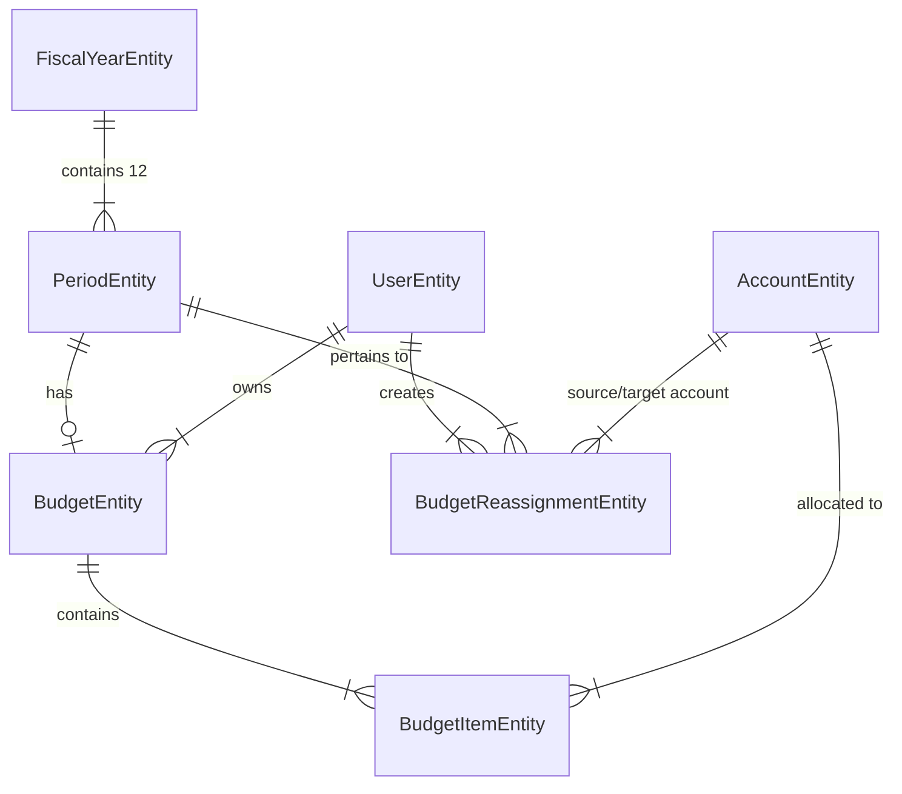

# Data Model: Budget Planning Matrix & Execution Control UX

**Branch**: `017-budget-planning-ux` | **Date**: 2026-08-12 | **Spec**: [spec.md](file:///C:/Users/amend/.gemini/antigravity/worktrees/sistema-contable/redesign_budget_planning_ux/specs/017-budget-planning-ux/spec.md)

---

## Entity Schema & Definitions

### 1. BudgetEntity (`budgets`)

Represents a monthly budget header container linked to a specific accounting period and user.

| Field       | Type      | Attributes          | Description                       |
| :---------- | :-------- | :------------------ | :-------------------------------- |
| `id`        | UUID      | Primary Key         | Unique budget identifier          |
| `userId`    | UUID      | Foreign Key         | Owner user ID                     |
| `periodId`  | UUID      | Foreign Key, Unique | Linked period ID                  |
| `name`      | String    | Not Null            | Display name (e.g., "Junio 2026") |
| `createdAt` | Timestamp | Auto                | Creation timestamp                |
| `updatedAt` | Timestamp | Auto                | Last modification timestamp       |

---

36: ### 2. BudgetItemEntity (`budget_items`)
37:
38: Represents individual account allocations for a monthly budget.
39:
40: | Field | Type | Attributes | Description |
41: | :--- | :--- | :--- | :--- |
42: | `id` | UUID | Primary Key | Unique item identifier |
43: | `budgetId` | UUID | Foreign Key | Parent budget ID |
44: | `accountId` | UUID | Foreign Key | Linked chart of account ID |
45: | `amount` | Decimal(18,4) | Not Null, Default 0 | Allocated budget amount |
46: | `flowIntention` | Enum | Nullable | Intention for balance sheet accounts: `'PAY'`, `'RECEIVE'`, `'INVEST'`, `'SAVE'`, `'DIVEST'`. Null for P&L accounts. |
47:
48: **Constraints**:
49: - Unique index on `(budgetId, accountId)`.
50: - Foreign key cascade delete on `budgetId` and `accountId`.
51: - Validation: Cannot budget for `EQUITY` accounts or cash/bank liquid asset accounts (`isCashOrBank = true`). Account status must be `ACTIVE`.
52: - Flow Intention validation:
53: - Liability accounts accept `'PAY'` or `'RECEIVE'`.
54: - Asset accounts accept `'INVEST'`, `'SAVE'`, or `'DIVEST'`.
55:
56: ---

### 3. BudgetReassignmentEntity (`budget_reassignments`) [NEW]

Audit trail entity recording inter-account budget transfers within an active period.

| Field             | Type          | Attributes    | Description                |
| :---------------- | :------------ | :------------ | :------------------------- |
| `id`              | UUID          | Primary Key   | Unique reassignment ID     |
| `userId`          | UUID          | Foreign Key   | User initiating transfer   |
| `periodId`        | UUID          | Foreign Key   | Target period ID           |
| `sourceAccountId` | UUID          | Foreign Key   | Account giving up budget   |
| `targetAccountId` | UUID          | Foreign Key   | Account receiving budget   |
| `amount`          | Decimal(18,4) | Not Null, > 0 | Amount transferred         |
| `reason`          | String        | Nullable      | Justification for transfer |
| `createdAt`       | Timestamp     | Auto          | Reassignment timestamp     |

---

## Validation & Business Rules

1. **Matrix Cell Values**: Must be non-negative finite numbers for Income/Expense/Liability/Asset budget items.
2. **Locked Periods**: Budgets linked to closed periods (`status = 'CLOSED'`) are read-only. Attempts to update or reassign funds throw `BadRequestException`.
3. **Reassignment Validation**:
   - Source account residual available budget must be $\ge$ transfer amount.
   - Source and target accounts must belong to the user and be active.
   - Source and target accounts cannot be the same account.
4. **Prior Year Baseline Calculation**:
   - For `INCOME` accounts: $\text{Actual} = \text{Credit} - \text{Debit}$.
   - For `EXPENSE` accounts: $\text{Actual} = \text{Debit} - \text{Credit}$.
   - Accounts without historical records default to `0`.
