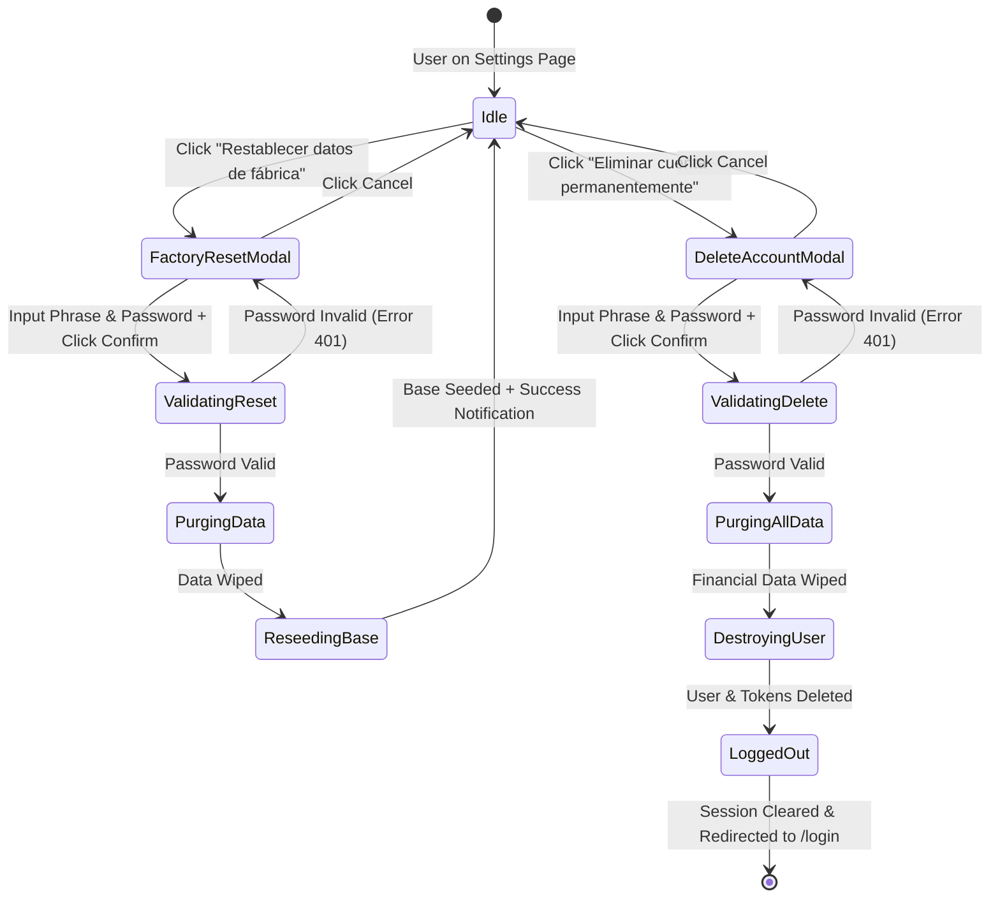

# Data Model: Danger Zone Settings - Factory Reset & Account Deletion

## 1. Entities & Lifecycle Impacts

### 1.1 Affected Entities Summary

| Entity                         | Table Name                | Scope               | Factory Reset Action                     | Account Deletion Action       |
| ------------------------------ | ------------------------- | ------------------- | ---------------------------------------- | ----------------------------- |
| **UserEntity**                 | `users`                   | User Identity       | **Preserved** (Unchanged)                | **Deleted** (Hard Delete)     |
| **PasswordResetTokenEntity**   | `password_reset_tokens`   | Auth Tokens         | **Preserved / Wiped**                    | **Deleted** (Cascaded)        |
| **AccountEntity**              | `accounts`                | Chart of Accounts   | **Wiped & Re-seeded** with base accounts | **Deleted**                   |
| **FiscalYearEntity**           | `fiscal_years`            | Accounting Years    | **Deleted**                              | **Deleted**                   |
| **PeriodEntity**               | `periods`                 | Monthly Periods     | **Deleted**                              | **Deleted**                   |
| **AccountPeriodBalanceEntity** | `account_period_balances` | Monthly Balances    | **Deleted**                              | **Deleted**                   |
| **BudgetEntity**               | `budgets`                 | Budgets             | **Deleted**                              | **Deleted**                   |
| **BudgetItemEntity**           | `budget_items`            | Budget Matrix Items | **Deleted**                              | **Deleted**                   |
| **BudgetReassignmentEntity**   | `budget_reassignments`    | Fund Transfers      | **Deleted**                              | **Deleted**                   |
| **TransactionEntity**          | `transactions`            | Ledger Transactions | **Deleted**                              | **Deleted**                   |
| **JournalEntryEntity**         | `journal_entries`         | Journal Entries     | **Deleted**                              | **Deleted**                   |
| **CurrencyEntity**             | `currencies`              | Reference Data      | **Preserved** (Shared/System)            | **Preserved** (Shared/System) |

---

## 2. DTOs & Validation Schemas (`@sistema-contable/shared`)

### 2.1 Danger Zone Action Enum & Constants

```typescript
export enum DangerZoneAction {
  FACTORY_RESET = 'FACTORY_RESET',
  DELETE_ACCOUNT = 'DELETE_ACCOUNT',
}

export const FACTORY_RESET_PHRASE = 'RESTABLECER DATOS';
export const DELETE_ACCOUNT_PHRASE = 'ELIMINAR MI CUENTA';
```

### 2.2 Factory Reset Request Schema

```typescript
export const FactoryResetRequestSchema = z.object({
  confirmationPhrase: z.literal(FACTORY_RESET_PHRASE, {
    errorMap: () => ({ message: `Debe escribir exactamente "${FACTORY_RESET_PHRASE}"` }),
  }),
  currentPassword: z.string().min(1, 'La contraseña actual es requerida'),
});

export type FactoryResetRequest = z.infer<typeof FactoryResetRequestSchema>;
```

### 2.3 Delete Account Request Schema

```typescript
export const DeleteAccountRequestSchema = z.object({
  confirmationPhrase: z
    .string()
    .refine((val) => val === DELETE_ACCOUNT_PHRASE, {
      message: `Debe escribir exactamente "${DELETE_ACCOUNT_PHRASE}"`,
    }),
  currentPassword: z.string().min(1, 'La contraseña actual es requerida'),
});

export type DeleteAccountRequest = z.infer<typeof DeleteAccountRequestSchema>;
```

### 2.4 Danger Zone Response Schema

```typescript
export const DangerZoneResponseSchema = z.object({
  success: z.boolean(),
  message: z.string(),
  action: z.nativeEnum(DangerZoneAction),
  timestamp: z.string().datetime(),
});

export type DangerZoneResponse = z.infer<typeof DangerZoneResponseSchema>;
```

---

## 3. Starter Accounts Seed Template (`DEFAULT_STARTER_ACCOUNTS`)

Used during Factory Reset to re-initialize a baseline chart of accounts:

```typescript
export interface StarterAccountDefinition {
  name: string;
  type: 'ASSET' | 'LIABILITY' | 'EQUITY' | 'INCOME' | 'EXPENSE';
  isCashOrBank?: boolean;
  systemRole?: 'NET_INCOME' | 'RETAINED_EARNINGS';
}

export const DEFAULT_STARTER_ACCOUNTS: StarterAccountDefinition[] = [
  // 1. Activos
  { name: 'Caja y Efectivo', type: 'ASSET', isCashOrBank: true },
  { name: 'Cuenta Bancaria', type: 'ASSET', isCashOrBank: true },

  // 2. Pasivos
  { name: 'Tarjetas de Crédito', type: 'LIABILITY' },
  { name: 'Cuentas por Pagar', type: 'LIABILITY' },

  // 3. Patrimonio Neto
  { name: 'Capital Inicial', type: 'EQUITY' },
  { name: 'Resultado del Ejercicio', type: 'EQUITY', systemRole: 'NET_INCOME' },
  { name: 'Utilidades Retenidas', type: 'EQUITY', systemRole: 'RETAINED_EARNINGS' },

  // 4. Ingresos
  { name: 'Sueldo y Salarios', type: 'INCOME' },
  { name: 'Ingresos Extraordinarios', type: 'INCOME' },

  // 5. Gastos
  { name: 'Alimentación y Supermercado', type: 'EXPENSE' },
  { name: 'Servicios Básicos (Luz, Agua, Internet)', type: 'EXPENSE' },
  { name: 'Transporte y Movilidad', type: 'EXPENSE' },
  { name: 'Salud y Cuidado Personal', type: 'EXPENSE' },
  { name: 'Otros Gastos', type: 'EXPENSE' },
];
```

---

## 4. State Transitions & Verification Flow


