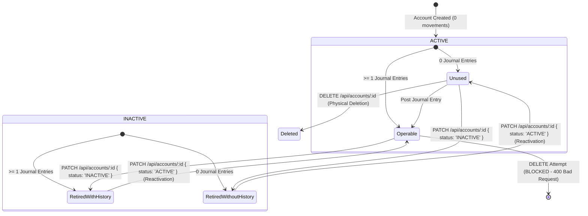

# Data Model: Account Reactivation & Lifecycle Management

## 1. Entities & Schema

### `AccountEntity` (`accounts` table)

Represents a ledger account within the chart of accounts.

| Field          | Type          | Modifiers / Constraints                                   | Description                          |
| :------------- | :------------ | :-------------------------------------------------------- | :----------------------------------- |
| `id`           | `uuid`        | PK, PrimaryGeneratedColumn                                | Unique account identifier            |
| `userId`       | `uuid`        | FK (`users.id`), NOT NULL, Index                          | Owner of the account                 |
| `name`         | `varchar`     | NOT NULL                                                  | Account name (unique per user)       |
| `type`         | `varchar(15)` | Enum: `ASSET`, `LIABILITY`, `EQUITY`, `INCOME`, `EXPENSE` | Account classification nature        |
| `currencyId`   | `uuid`        | FK (`currencies.id`), NOT NULL                            | Associated currency                  |
| `parentId`     | `uuid`        | FK (`accounts.id`), Nullable                              | Parent account for hierarchical tree |
| `status`       | `varchar(10)` | Enum: `ACTIVE`, `INACTIVE`, DEFAULT `'ACTIVE'`            | Operational lifecycle state          |
| `isCashOrBank` | `boolean`     | DEFAULT `false`                                           | Liquid cash/bank indicator           |
| `metadata`     | `jsonb`       | Nullable                                                  | Additional custom metadata           |
| `systemRole`   | `varchar(30)` | Nullable, Enum: `NET_INCOME`, `RETAINED_EARNINGS`         | Reserved system account indicator    |

### `JournalEntryEntity` (`journal_entries` table)

Immutable record of financial debits and credits posted to ledger accounts.

| Field           | Type          | Modifiers / Constraints          | Description                       |
| :-------------- | :------------ | :------------------------------- | :-------------------------------- |
| `id`            | `uuid`        | PK, PrimaryGeneratedColumn       | Unique entry line identifier      |
| `transactionId` | `uuid`        | FK (`transactions.id`), NOT NULL | Associated parent transaction     |
| `accountId`     | `uuid`        | FK (`accounts.id`), NOT NULL     | Referenced ledger account         |
| `entryType`     | `varchar(10)` | Enum: `DEBIT`, `CREDIT`          | Nature of entry                   |
| `amount`        | `numeric`     | NOT NULL, > 0                    | Amount in account currency        |
| `amountBase`    | `numeric`     | NOT NULL, > 0                    | Amount converted to base currency |

---

## 2. Account Lifecycle State Machine

---

## 3. Operational Behavior Matrix

| Account State | Has Movements? | Allowed Actions          | Visibility in Form Selectors | Visibility in Current Balance Sheet |     Visibility in Historical Reports     |
| :------------ | :------------: | :----------------------- | :--------------------------: | :---------------------------------: | :--------------------------------------: |
| `ACTIVE`      |       No       | Edit, Deactivate, Delete |           Visible            |        Visible (if non-zero)        |                 Visible                  |
| `ACTIVE`      |      Yes       | Edit Name, Deactivate    |           Visible            |        Visible (if non-zero)        |                 Visible                  |
| `INACTIVE`    |       No       | Edit, Reactivate, Delete |          **Hidden**          |             **Hidden**              |                 Visible                  |
| `INACTIVE`    |      Yes       | Edit Name, Reactivate    |          **Hidden**          |      **Hidden** (if 0 balance)      | **Visible** (if had movements in period) |

---

## 4. Validation Rules & Invariants

1. **Deletion Immutability Guard (Rule V-01)**:
   - Physical deletion (`DELETE /api/accounts/:id`) is strictly forbidden if `JournalEntryEntity.count({ where: { accountId } }) > 0`.
   - Error returned: `400 Bad Request` with message `"Cannot delete account with existing transactions. Deactivate the account instead."`.

2. **Reactivation Invariant (Rule V-02)**:
   - Any account with `status: 'INACTIVE'` may be updated to `status: 'ACTIVE'` at any time via `PATCH /api/accounts/:id` with `{ status: 'ACTIVE' }`.
   - Reactivation is idempotent and immediately restores account visibility in transaction dropdowns.

3. **Selector Segregation (Rule V-03)**:
   - Transaction inputs (`/transactions/new`, `/transactions/asiento-libre`, `TransactionModal`) and budget item editors MUST query or filter for `status: 'ACTIVE'` accounts only.

4. **Historical Report Preservation (Rule V-04)**:
   - Ledger queries, trial balances, and financial statements must join historical records without filtering out `INACTIVE` accounts that possess entries in the target period.
