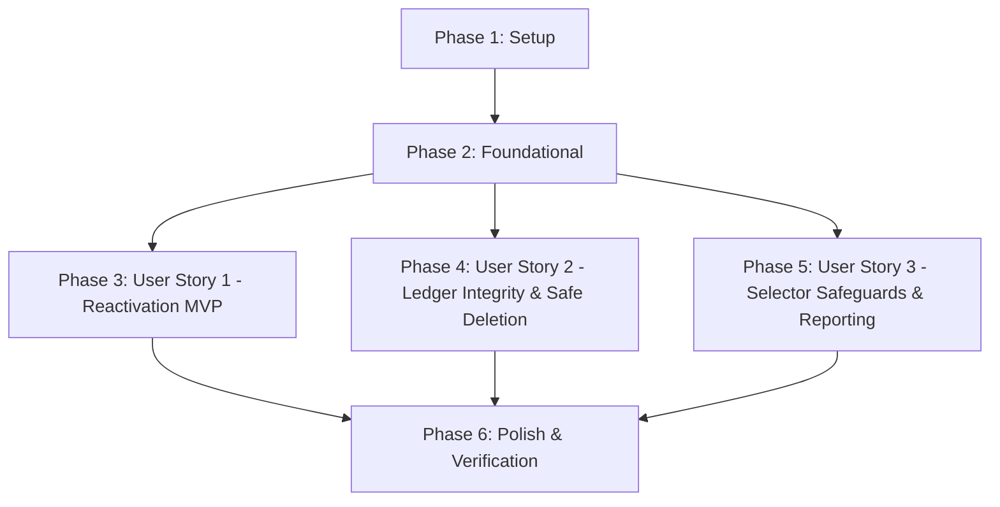

# Tasks: Account Reactivation & Lifecycle Management

**Input**: Design documents from `specs/019-account-reactivation-lifecycle/`
**Prerequisites**: [plan.md](file:///c:/Users/amend/Dev/sistema-contable/specs/019-account-reactivation-lifecycle/plan.md), [spec.md](file:///c:/Users/amend/Dev/sistema-contable/specs/019-account-reactivation-lifecycle/spec.md), [data-model.md](file:///c:/Users/amend/Dev/sistema-contable/specs/019-account-reactivation-lifecycle/data-model.md), [research.md](file:///c:/Users/amend/Dev/sistema-contable/specs/019-account-reactivation-lifecycle/research.md), [contracts/accounts-lifecycle-api.yaml](file:///c:/Users/amend/Dev/sistema-contable/specs/019-account-reactivation-lifecycle/contracts/accounts-lifecycle-api.yaml)

**Organization**: Tasks are grouped by user story to enable independent implementation and testing of each story.

## Format: `- [ ] [TaskID] [P?] [Story?] Description with file path`

- **[P]**: Can run in parallel (different files, no dependencies)
- **[Story]**: Which user story this task belongs to (`[US1]`, `[US2]`, `[US3]`)
- Every task includes exact file paths

---

## Phase 1: Setup (Shared Infrastructure)

**Purpose**: Centralize type definitions, enums, and request schemas in shared monorepo package.

- [x] T001 Add `AccountStatus` enum (`ACTIVE`, `INACTIVE`) and `AccountStatusSchema` in `shared/src/index.ts`
- [x] T002 [P] Update `UpdateAccountRequestSchema` and `UpdateAccountRequest` type in `shared/src/index.ts` to include optional `status: AccountStatusSchema`
- [x] T003 [P] Create backend DTO validation class `UpdateAccountDto` in `backend/src/infrastructure/controllers/dto/update-account.dto.ts`

---

## Phase 2: Foundational (Blocking Prerequisites)

**Purpose**: Core API controller and client library foundations that MUST be complete before user stories.

**⚠️ CRITICAL**: No user story work can begin until this phase is complete.

- [x] T004 Update `AccountController.update` in `backend/src/infrastructure/controllers/account.controller.ts` to accept `UpdateAccountDto` with status
- [x] T005 [P] Update `api.accounts.update` method signature and payload in `frontend/src/services/api.ts` to accept `status?: 'ACTIVE' | 'INACTIVE'`
- [x] T006 [P] Update `api.accounts.list` in `frontend/src/services/api.ts` to support optional `status?: 'ACTIVE' | 'INACTIVE' | 'ALL'` query parameter

**Checkpoint**: Foundation ready — user story implementation can now begin in parallel or sequence.

---

## Phase 3: User Story 1 - Reactivate an Inactive Account from Chart of Accounts (Priority: P1) 🎯 MVP

**Goal**: Allow users to reactivate any inactive account directly from the Chart of Accounts and rubros management tables, updating its operational status to `ACTIVE` and immediately restoring its availability for transactions.

**Independent Test**: Mark an account as `INACTIVE`, navigate to `/accounts/manage` or `/accounts`, click "Reactivar", verify status changes to `ACTIVE` with updated badges/styling, and confirm the account is operational.

### Tests for User Story 1 (TDD - Mandatory per Principle V) ⚠️

> **NOTE: Write these tests FIRST, ensure they FAIL before implementation**

- [x] T007 [P] [US1] Unit tests for `UpdateAccountUseCase` status transitions (`ACTIVE` <-> `INACTIVE`) in `backend/src/application/accounts/update-account.use-case.spec.ts`
- [x] T008 [P] [US1] Component tests for Reactivar button action and state update in `frontend/src/tests/AccountsManagePage.test.tsx`
- [x] T009 [P] [US1] Component tests for Inactiva badge and status display in `frontend/src/tests/AccountsList.test.tsx`

### Implementation for User Story 1

- [x] T010 [US1] Update `UpdateAccountUseCase` in `backend/src/application/accounts/update-account.use-case.ts` to support updating `status` (`ACTIVE` / `INACTIVE`)
- [x] T011 [US1] Update `AccountsManagePage` in `frontend/src/app/accounts/manage/page.tsx` to replace static "Deshabilitado" label with interactive "Reactivar" button and "Desactivar" button calling `api.accounts.update`
- [x] T012 [US1] Update `AccountsList` in `frontend/src/components/AccountsList.tsx` and `frontend/src/app/accounts/page.tsx` to display inactive status badges and provide reactivation triggers

**Checkpoint**: User Story 1 is fully operational and independently testable (MVP delivery).

---

## Phase 4: User Story 2 - Enforce Ledger Integrity Rules for Inactivation vs Physical Deletion (Priority: P1)

**Goal**: Safeguard GAAP/IFRS ledger immutability by strictly blocking physical deletion of accounts with $\ge 1$ historical journal entries (HTTP 400 Bad Request) while permitting physical deletion of unused accounts (0 movements).

**Independent Test**: Attempt physical deletion of an account with $\ge 1$ journal entries and verify HTTP 400 Bad Request error with message `"Cannot delete account with existing transactions. Deactivate the account instead."`; attempt physical deletion of an account with 0 movements and verify HTTP 200 with `{ success: true, action: 'DELETED' }`.

### Tests for User Story 2 (TDD - Mandatory per Principle V) ⚠️

> **NOTE: Write these tests FIRST, ensure they FAIL before implementation**

- [x] T013 [P] [US2] Unit tests for `DeleteAccountUseCase` blocking deletion if journal entries exist and permitting deletion when entries are 0 in `backend/src/application/accounts/delete-account.use-case.spec.ts`
- [x] T014 [P] [US2] Integration tests for deletion immutability rules and lifecycle transitions in `backend/tests/integration/account-lifecycle.spec.ts`

### Implementation for User Story 2

- [x] T015 [US2] Update `DeleteAccountUseCase` in `backend/src/application/accounts/delete-account.use-case.ts` to throw `BadRequestException` when `entriesCount > 0` instead of silent deactivation
- [x] T016 [US2] Update error feedback and confirmation dialogs in `frontend/src/app/accounts/page.tsx` and `frontend/src/app/accounts/manage/page.tsx` to handle 400 deletion errors and guide users toward inactivation

**Checkpoint**: User Stories 1 AND 2 are functional and enforce complete ledger integrity.

---

## Phase 5: User Story 3 - Inactive Account Safeguards and Visibility in Operation & Reporting (Priority: P2)

**Goal**: Shield inactive accounts from daily transaction entry and budget allocations while preserving retrospective accuracy and visibility in historical accounting reports.

**Independent Test**: Verify that inactive accounts are omitted from `TransactionModal`, `JournalEntryRow`, `new/page.tsx`, `asiento-libre/page.tsx`, and `BudgetAccountModal`, while past historical reports (`Libro Mayor`, `Balance General`) display past period movements accurately.

### Tests for User Story 3 (TDD - Mandatory per Principle V) ⚠️

> **NOTE: Write these tests FIRST, ensure they FAIL before implementation**

- [x] T017 [P] [US3] Unit tests for `AccountController.list` with `status` filter in `backend/src/infrastructure/controllers/account.controller.spec.ts`
- [x] T018 [P] [US3] Component tests verifying inactive account exclusion in `frontend/src/tests/TransactionModal.test.tsx` and `frontend/src/tests/JournalEntryRow.test.tsx`
- [x] T019 [P] [US3] Component tests verifying inactive account exclusion in `frontend/src/tests/BudgetAccountModal.test.tsx`

### Implementation for User Story 3

- [x] T020 [US3] Update `AccountController.list` in `backend/src/infrastructure/controllers/account.controller.ts` to filter accounts by `status` query parameter (`ACTIVE`, `INACTIVE`, `ALL`)
- [x] T021 [US3] Update `TransactionModal` in `frontend/src/components/TransactionModal.tsx` and transaction entry pages in `frontend/src/app/transactions/new/page.tsx` and `frontend/src/app/transactions/asiento-libre/page.tsx` to query only `ACTIVE` accounts
- [x] T022 [US3] Update combobox filtering in `JournalEntryRow` in `frontend/src/components/JournalEntryRow.tsx` to exclude inactive accounts from selection
- [x] T023 [US3] Update `BudgetAccountModal` in `frontend/src/components/budgets/BudgetAccountModal.tsx` to exclude inactive accounts from new budget allocation
- [x] T024 [US3] Verify historical reporting query behavior in `backend/src/application/reports/` to ensure inactive accounts with movements render in past periods and are omitted if zero-balance in current period

**Checkpoint**: All user stories functional, protected against data entry mistakes, and compliant with audit standards.

---

## Phase 6: Polish & Cross-Cutting Concerns

**Purpose**: Full regression validation, ESLint compliance, and quickstart verification.

- [x] T025 [P] Monorepo ESLint compliance check (`npm --prefix backend run lint` & `npm --prefix frontend run lint`) with zero errors and zero warnings
- [x] T026 [P] Monorepo automated test suite verification (`npm --prefix backend test`, `npm --prefix frontend test`)
- [x] T027 Run end-to-end validation scenarios documented in `specs/019-account-reactivation-lifecycle/quickstart.md`

---

## Dependencies & Execution Order

### Phase Dependencies

- **Setup (Phase 1)**: No dependencies — start immediately.
- **Foundational (Phase 2)**: Depends on Setup completion — BLOCKS all user stories.
- **User Story 1 (Phase 3 - P1)**: Depends on Foundational completion.
- **User Story 2 (Phase 4 - P1)**: Depends on Foundational completion. Can run in parallel with US1.
- **User Story 3 (Phase 5 - P2)**: Depends on Foundational completion and benefits from US1/US2.
- **Polish (Phase 6)**: Depends on all user stories being complete.

### User Story Dependencies



### Within Each User Story

- TDD Tests written FIRST and confirmed failing before implementation
- Domain use cases and backend services before controllers
- Backend endpoints before frontend client integration
- UI components and state updates before integration verification

### Parallel Opportunities

- **Phase 1**: T002 and T003 can execute in parallel after T001
- **Phase 2**: T005 and T006 can execute in parallel
- **Phase 3 (US1)**: Tests T007, T008, and T009 can be authored in parallel
- **Phase 4 (US2)**: Tests T013 and T014 can be authored in parallel
- **Phase 5 (US3)**: Tests T017, T018, and T019 can be authored in parallel
- **Phase 6**: T025 and T026 can run concurrently

---

## Parallel Example: User Story 1

```bash
# Launch test creation for User Story 1 in parallel:
Task T007: "Unit tests for UpdateAccountUseCase status transitions in backend/src/application/accounts/update-account.use-case.spec.ts"
Task T008: "Component tests for Reactivar button action in frontend/src/tests/AccountsManagePage.test.tsx"
Task T009: "Component tests for Inactiva badge in frontend/src/tests/AccountsList.test.tsx"
```

---

## Implementation Strategy

### MVP First (User Story 1 Only)

1. Complete Phase 1: Setup (T001 - T003)
2. Complete Phase 2: Foundational (T004 - T006)
3. Complete Phase 3: User Story 1 (T007 - T012)
4. **STOP and VALIDATE**: Verify account reactivation from `/accounts/manage` in <2 clicks (SC-001)

### Incremental Delivery

1. Setup + Foundational -> Foundation ready
2. User Story 1 -> Reactivation operable (MVP)
3. User Story 2 -> Deletion protection & ledger integrity enforced (SC-002)
4. User Story 3 -> Form selector segregation & historical reporting verified (SC-003, SC-004)
5. Polish -> Monorepo ESLint (0 errors, 0 warnings) and 100% test pass
