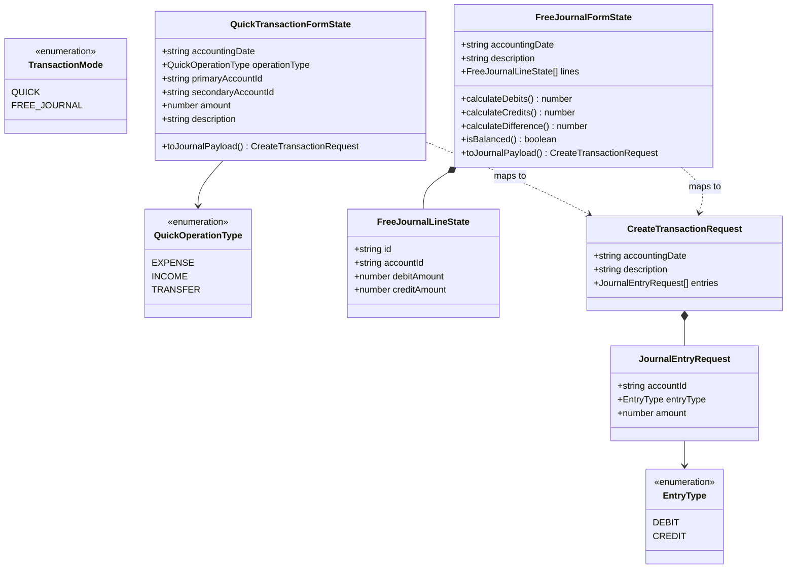
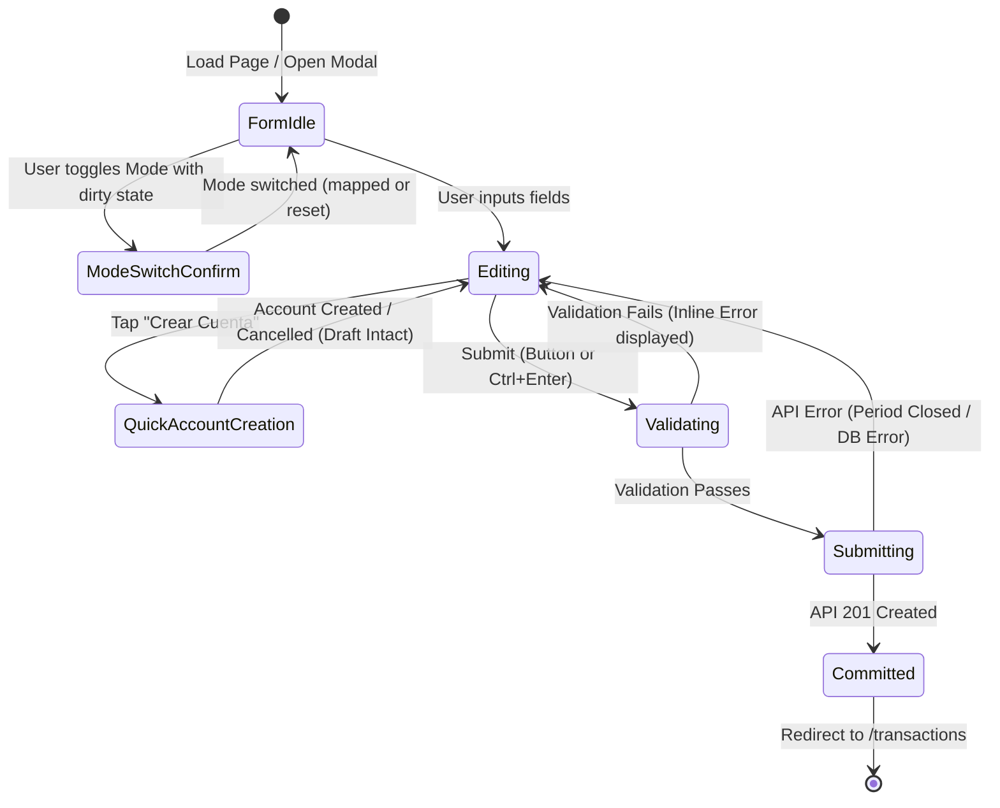

# Data Model: Dual-Mode Transaction Creation & Accounting Ledger

**Feature**: Dual-Mode Transaction Creation & Accounting UX Optimization  
**Branch**: `022-dual-mode-transactions`  
**Date**: 2026-08-16

---

## 1. Core Domain & View Entities



---

## 2. Entity Definitions & Schemas

### 2.1 Enums & Identifiers

```typescript
export enum TransactionMode {
  QUICK = 'QUICK',
  FREE_JOURNAL = 'FREE_JOURNAL',
}

export enum QuickOperationType {
  EXPENSE = 'EXPENSE', // Gasto
  INCOME = 'INCOME', // Ingreso
  TRANSFER = 'TRANSFER', // Transferencia Interna
}
```

---

### 2.2 Quick Transaction Form Model (`QuickTransactionFormState`)

Represents the user-facing state for routine single-amount operations.

| Field                | Type                    | Required | Description                                                                        |
| :------------------- | :---------------------- | :------- | :--------------------------------------------------------------------------------- |
| `accountingDate`     | `string` (`YYYY-MM-DD`) | Yes      | Date of the financial event (defaults to today's local date)                       |
| `operationType`      | `QuickOperationType`    | Yes      | Selected operation template (`EXPENSE`, `INCOME`, `TRANSFER`)                      |
| `primaryAccountId`   | `string` (UUID)         | Yes      | **Gasto/Ingreso**: Cuenta de Pago/Cobro (`Cuenta`). **Transfer**: `Cuenta Origen`. |
| `secondaryAccountId` | `string` (UUID)         | Yes      | **Gasto/Ingreso**: Rubro Contable (`Categoría`). **Transfer**: `Cuenta Destino`.   |
| `amount`             | `number`                | Yes      | Single transaction amount (\(> 0\))                                                |
| `description`        | `string`                | Yes      | Transaction memo / glosa                                                           |

---

### 2.3 Free Journal Form Model (`FreeJournalFormState`)

Represents the multi-line grid state for advanced journal entries.

```typescript
export interface FreeJournalLineState {
  id: string; // Transient client UUID for stable React list rendering
  accountId: string;
  debitAmount: number | '';
  creditAmount: number | '';
}

export interface FreeJournalFormState {
  accountingDate: string;
  description: string;
  lines: FreeJournalLineState[];
}
```

---

### 2.4 Canonical Backend Ledger Payload (`CreateTransactionRequest`)

Both form modes compile into the standard immutable double-entry payload consumed by `POST /api/transactions`.

```typescript
export interface JournalEntryRequest {
  accountId: string;
  entryType: 'DEBIT' | 'CREDIT';
  amount: number;
}

export interface CreateTransactionRequest {
  accountingDate: string; // YYYY-MM-DD
  description: string;
  entries: JournalEntryRequest[];
}
```

---

## 3. Double-Entry Transformation Rules

### 3.1 Quick Transaction to Double-Entry Mapping

Given user inputs: \(Date, Description, A_1 (\text{Primary Account}), A_2 (\text{Secondary Account}), M (\text{Amount})\):

#### 1. Gasto (Expense)

- **Conceptual Meaning**: Outflow of funds from a monetary account to pay for an operational expense.
- **Double-Entry Lines**:
  1. `accountId: secondaryAccountId (EXPENSE)`, `entryType: 'DEBIT'`, `amount: M`
  2. `accountId: primaryAccountId (ASSET/LIABILITY)`, `entryType: 'CREDIT'`, `amount: M`
- **Integrity**: \(\sum \text{Debits} = M = \sum \text{Credits}\) (Difference = 0).

#### 2. Ingreso (Income)

- **Conceptual Meaning**: Inflow of funds into a monetary account generated from a revenue category.
- **Double-Entry Lines**:
  1. `accountId: primaryAccountId (ASSET)`, `entryType: 'DEBIT'`, `amount: M`
  2. `accountId: secondaryAccountId (INCOME)`, `entryType: 'CREDIT'`, `amount: M`
- **Integrity**: \(\sum \text{Debits} = M = \sum \text{Credits}\) (Difference = 0).

#### 3. Transferencia Interna (Internal Transfer)

- **Conceptual Meaning**: Internal movement between two asset accounts (e.g. Bank to Cash).
- **Double-Entry Lines**:
  1. `accountId: secondaryAccountId (Cuenta Destino - ASSET)`, `entryType: 'DEBIT'`, `amount: M`
  2. `accountId: primaryAccountId (Cuenta Origen - ASSET)`, `entryType: 'CREDIT'`, `amount: M`
- **Integrity**: \(\sum \text{Debits} = M = \sum \text{Credits}\) (Difference = 0). Validation requires \(A_1 \neq A_2\).

---

### 3.2 Free Journal Entry Mapping & Auto-Balancing Rules

For a grid with \(N\) lines \(\{L_1, L_2, \dots, L_N\}\):

1. **Mutual Exclusivity**:
   \[
   \forall L_i, \quad L_i.\text{debitAmount} > 0 \implies L_i.\text{creditAmount} = ''
   \]
   \[
   \forall L_i, \quad L_i.\text{creditAmount} > 0 \implies L_i.\text{debitAmount} = ''
   \]
2. **Aggregations**:
   \[
   D*{\text{total}} = \sum*{i=1}^N (L*i.\text{debitAmount} \text{ if numerical else } 0)
   \]
   \[
   C*{\text{total}} = \sum*{i=1}^N (L_i.\text{creditAmount} \text{ if numerical else } 0)
   \]
   \[
   \Delta = |D*{\text{total}} - C\_{\text{total}}|
   \]
3. **Auto-Fill Plug-in Algorithm**:
   - When a new line \(L\_{N+1}\) is created:
     - If \(D*{\text{total}} > C*{\text{total}}\): \(L*{N+1}.\text{creditAmount} \leftarrow \text{round}(\Delta, 2)\), \(L*{N+1}.\text{debitAmount} \leftarrow ''\)
     - If \(C*{\text{total}} > D*{\text{total}}\): \(L*{N+1}.\text{debitAmount} \leftarrow \text{round}(\Delta, 2)\), \(L*{N+1}.\text{creditAmount} \leftarrow ''\)
     - If \(D*{\text{total}} = C*{\text{total}}\): \(L*{N+1}.\text{debitAmount} \leftarrow ''\), \(L*{N+1}.\text{creditAmount} \leftarrow ''\)

---

## 4. Validation Rules & Invariants

| Code        | Invariant / Validation Rule                                                                                      | Mode Applicable | Error Message / Trigger                                                       |
| :---------- | :--------------------------------------------------------------------------------------------------------------- | :-------------- | :---------------------------------------------------------------------------- |
| **VAL-001** | `amount > 0`                                                                                                     | Both Modes      | "El monto debe ser mayor a cero."                                             |
| **VAL-002** | `description.trim().length > 0`                                                                                  | Both Modes      | "Debe ingresar una descripción / glosa para la transacción."                  |
| **VAL-003** | `accountingDate` matches `YYYY-MM-DD`                                                                            | Both Modes      | "Fecha contable inválida."                                                    |
| **VAL-004** | All selected accounts must be active (`status === 'ACTIVE'`) and non-system role (`systemRole !== 'NET_INCOME'`) | Both Modes      | "La cuenta seleccionada no está habilitada para registros operativos."        |
| **VAL-005** | `primaryAccountId !== secondaryAccountId` in Transfer                                                            | Quick Mode      | "La cuenta destino debe ser distinta a la cuenta origen."                     |
| **VAL-006** | Total Debits \(\equiv\) Total Credits (\(\Delta < 0.001\))                                                       | Free Mode       | "El asiento está descuadrado por [Monto]. Debe y Haber deben ser iguales."    |
| **VAL-007** | Minimum of 2 valid entries                                                                                       | Free Mode       | "Un asiento contable requiere al menos dos apuntes."                          |
| **VAL-008** | Accounting period must be OPEN (not CLOSED or PLANNING)                                                          | Backend         | "El período contable para la fecha indicada está cerrado o en planificación." |

---

## 5. Lifecycle & State Machine


