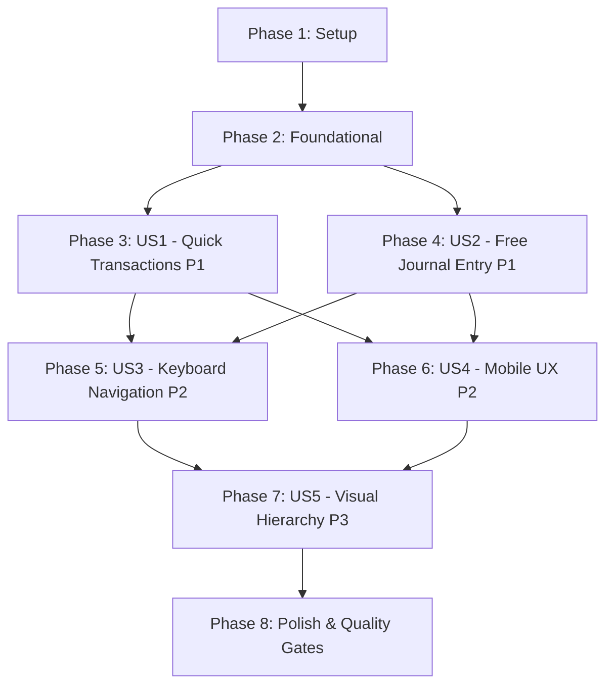

# Tasks: Dual-Mode Transaction Creation & Accounting UX Optimization

**Input**: Design documents from `/specs/022-dual-mode-transactions/`  
**Prerequisites**: [plan.md](plan.md), [spec.md](spec.md), [data-model.md](data-model.md), [contracts/transaction-entry.contract.md](contracts/transaction-entry.contract.md), [research.md](research.md), [quickstart.md](quickstart.md)  
**Tests**: Mandated by Constitution Principle V (Strict Test-Driven Development). Tests must be written and approved before implementation.  
**Organization**: Tasks are grouped by user story to enable independent implementation and testing of each story.

---

## Format: `[ID] [P?] [Story] Description`

- **[P]**: Can run in parallel (different files, no dependencies)
- **[Story]**: Which user story this task belongs to (`[US1]`, `[US2]`, `[US3]`, `[US4]`, `[US5]`)
- Include exact file paths in descriptions

---

## Phase 1: Setup (Shared Infrastructure)

**Purpose**: Shared types, schemas, and component structure initialization

- [x] T001 [P] Add TransactionMode, QuickOperationType enums, Zod schemas, and TypeScript types to shared/src/index.ts
- [x] T002 [P] Create frontend/src/components/transactions directory structure and index exports in frontend/src/components/transactions/index.ts

---

## Phase 2: Foundational (Blocking Prerequisites)

**Purpose**: Core reusable components that MUST be complete before ANY user story can be fully implemented

**⚠️ CRITICAL**: No user story work can begin until this phase is complete

- [x] T003 [P] Create unit test for AccountPickerSheet component in frontend/src/tests/AccountPickerSheet.test.tsx
- [x] T004 Create AccountPickerSheet component with combobox filtering, category tabs, balance display, and quick create account action in frontend/src/components/transactions/AccountPickerSheet.tsx
- [x] T005 [P] Create unit test for ModeSelector component in frontend/src/tests/ModeSelector.test.tsx
- [x] T006 Create ModeSelector segmented control component in frontend/src/components/transactions/ModeSelector.tsx

**Checkpoint**: Foundation ready - user story implementation can now begin in parallel

---

## Phase 3: User Story 1 - Quick Transaction Recording for Routine Operations (Priority: P1) 🎯 MVP

**Goal**: Enable business users to record routine daily operational movements (Expenses, Incomes, and Internal Transfers) using a single-amount, guided form with a strict 5-step field order (`1. Fecha/Hora` → `2. Cuenta/Cuenta Origen` → `3. Categoría/Cuenta Destino` → `4. Monto` → `5. Concepto`) that automatically compiles into balanced double-entry ledger records.

**Independent Test**: Navigate to `/transactions/new`, select "Transacción Rápida", record an Expense, an Income, and an Internal Transfer through the 5-step sequence, submit, and verify that balanced `CreateTransactionRequest` payloads are dispatched and committed to the ledger.

### Tests for User Story 1

> **NOTE: Write these tests FIRST, ensure they FAIL before implementation**

- [x] T007 [P] [US1] Create unit tests for QuickTransactionForm (5-step field order, Expense/Income/Transfer double-entry compilation, and validation) in frontend/src/tests/QuickTransactionForm.test.tsx

### Implementation for User Story 1

- [x] T008 [US1] Implement QuickTransactionForm component with operation templates (Expense, Income, Transfer), 5-step field layout, inputMode="decimal", and double-entry payload mapper in frontend/src/components/transactions/QuickTransactionForm.tsx
- [x] T009 [US1] Integrate QuickTransactionForm and ModeSelector into frontend/src/app/transactions/new/page.tsx
- [x] T010 [US1] Update TransactionModal to support QuickTransactionForm mode in frontend/src/components/TransactionModal.tsx

**Checkpoint**: At this point, User Story 1 (Quick Transactions MVP) is fully functional and testable independently

---

## Phase 4: User Story 2 - Advanced Free Journal Entry Grid with Auto-Balancing (Priority: P1)

**Goal**: Provide accountants and advanced users with a tabular accounting spreadsheet grid featuring independent Debe and Haber columns, mutual exclusivity, real-time difference calculation, dynamic auto-fill difference suggestions for subsequent lines, and strict balance validation.

**Independent Test**: Navigate to `/transactions/new`, switch to "Asiento Libre", enter a Debit amount on Line 1, verify Line 2 auto-fills the difference in Credit, enter a partial Credit, add Line 3 to verify residual difference auto-fill, and confirm submission is blocked when unbalanced and enabled when balanced.

### Tests for User Story 2

> **NOTE: Write these tests FIRST, ensure they FAIL before implementation**

- [x] T011 [P] [US2] Create unit tests for FreeJournalEntryRow and FreeJournalEntryGrid (Debe/Haber mutual exclusivity, dynamic auto-fill difference calculation, and balance validation) in frontend/src/tests/FreeJournalEntryGrid.test.tsx

### Implementation for User Story 2

- [x] T012 [P] [US2] Implement FreeJournalEntryRow component with independent Debe and Haber inputs, mutual exclusivity clearing, and delete row action in frontend/src/components/transactions/FreeJournalEntryRow.tsx
- [x] T013 [US2] Implement FreeJournalEntryGrid component with multi-line state management, real-time difference calculation, auto-fill difference algorithm on new lines, and balance validation badge in frontend/src/components/transactions/FreeJournalEntryGrid.tsx
- [x] T014 [US2] Integrate FreeJournalEntryGrid into frontend/src/app/transactions/new/page.tsx with mode switching and draft confirmation
- [x] T015 [US2] Update frontend/src/components/TransactionModal.tsx to support FreeJournalEntryGrid mode
- [x] T016 [US2] Update frontend/src/app/transactions/asiento-libre/page.tsx to render FreeJournalEntryGrid or redirect with mode=FREE_JOURNAL

**Checkpoint**: At this point, User Stories 1 AND 2 both work independently and cover both transaction modes

---

## Phase 5: User Story 3 - Rapid Keyboard-First Desktop Navigation (Priority: P2)

**Goal**: Enable power users on desktop to navigate the entire transaction creation flow exclusively using keyboard shortcuts (linear Tab sequence, Arrow key combobox selection, Enter to advance, `Ctrl+Enter` / `Cmd+Enter` global submission, and rapid-submission debouncing).

**Independent Test**: Load `/transactions/new` on desktop, keep hands strictly on keyboard, Tab through fields, select accounts with Arrow keys + Enter, and submit the balanced transaction via `Ctrl+Enter`.

### Tests for User Story 3

> **NOTE: Write these tests FIRST, ensure they FAIL before implementation**

- [x] T017 [P] [US3] Create unit tests for keyboard navigation (Tab sequence, combobox arrow selection, and Ctrl/Cmd+Enter save shortcut) in frontend/src/tests/TransactionKeyboardNavigation.test.tsx

### Implementation for User Story 3

- [x] T018 [US3] Implement sequential tab navigation, combobox arrow key selection, and auto-advance focus in frontend/src/components/transactions/AccountPickerSheet.tsx
- [x] T019 [US3] Implement global Ctrl+Enter / Cmd+Enter submission handlers and double-click debouncing in frontend/src/components/transactions/QuickTransactionForm.tsx
- [x] T020 [US3] Implement global Ctrl+Enter / Cmd+Enter submission handlers, Enter-to-add-line, and double-click debouncing in frontend/src/components/transactions/FreeJournalEntryGrid.tsx

**Checkpoint**: Desktop power users can complete full transaction entries at high speed without using the mouse

---

## Phase 6: User Story 4 - Touch-First Mobile Accounting Experience for Both Modes (Priority: P2)

**Goal**: Ensure flawless usability on smartphone and tablet screens by providing a mobile bottom-sheet account picker overlay with search and category tabs, responsive stacked-card layout for Free Journal entries, and native decimal keypad invocation (`inputMode="decimal"`).

**Independent Test**: Open `/transactions/new` on mobile viewport (< 768px), tap account selector to verify fixed bottom sheet overlay with category tabs, verify Free Journal grid renders as stacked cards, and inspect monetary inputs to confirm native numeric keypad trigger.

### Tests for User Story 4

> **NOTE: Write these tests FIRST, ensure they FAIL before implementation**

- [x] T021 [P] [US4] Create unit and responsive layout tests for mobile bottom sheet overlay and stacked card rendering in frontend/src/tests/MobileTransactionUX.test.tsx

### Implementation for User Story 4

- [x] T022 [US4] Implement mobile bottom sheet modal overlay (`fixed inset-x-0 bottom-0 max-h-[85vh] rounded-t-2xl z-50`) with touch-friendly list items and category tab bar in frontend/src/components/transactions/AccountPickerSheet.tsx
- [x] T023 [US4] Implement responsive mobile stacked-card layout with full-width Debe/Haber touch inputs and row actions in frontend/src/components/transactions/FreeJournalEntryRow.tsx
- [x] T024 [US4] Add inputMode="decimal" and pattern attributes across all monetary amount inputs in frontend/src/components/transactions/QuickTransactionForm.tsx and frontend/src/components/transactions/FreeJournalEntryRow.tsx

**Checkpoint**: Both Quick Transaction and Free Journal Entry modes operate fluidly on mobile devices with zero viewport clipping

---

## Phase 7: User Story 5 - Clean Visual Hierarchy & Neutral Accounting Semantics (Priority: P3)

**Goal**: Provide a clean, distraction-free visual interface with a single consolidated action bar and neutral accounting palette for Debe and Haber (eliminating misleading traffic-light red/green conventions).

**Independent Test**: Inspect `/transactions/new` and `TransactionModal` across desktop and mobile to verify there is only one primary action bar, and verify Debe and Haber column headers and amounts use neutral slate/indigo typography.

### Tests for User Story 5

> **NOTE: Write these tests FIRST, ensure they FAIL before implementation**

- [x] T025 [P] [US5] Create visual hierarchy and semantic styling tests in frontend/src/tests/TransactionVisualHierarchy.test.tsx

### Implementation for User Story 5

- [x] T026 [US5] Refactor Debe and Haber column headers, amount badges, and balance indicator in frontend/src/components/transactions/FreeJournalEntryGrid.tsx to use neutral slate/indigo styling and clear Cuadrado/Descuadrado status badges
- [x] T027 [US5] Consolidate transaction form actions into a single primary action header on desktop and unified sticky action bar on mobile in frontend/src/app/transactions/new/page.tsx
- [x] T028 [US5] Standardize action controls and semantic styling in frontend/src/components/TransactionModal.tsx

**Checkpoint**: Interface adheres strictly to professional accounting ergonomics, neutral color semantics, and clean action placement

---

## Phase 8: Polish & Cross-Cutting Concerns

**Purpose**: Regression testing, test coverage verification, and static code quality compliance across the entire monorepo

- [x] T029 [P] Update existing frontend component tests affected by transaction changes in frontend/src/tests/TransactionModal.test.tsx and frontend/src/tests/JournalEntryRow.test.tsx
- [x] T030 [P] Run quickstart.md validation steps against frontend and backend test suites
- [x] T031 Run ESLint and TypeScript compilation check across shared, frontend, and backend packages with zero errors and zero warnings

---

## Dependencies & Execution Order

### Phase Dependencies



- **Setup (Phase 1)**: Can start immediately. Defines shared types and initial component structure.
- **Foundational (Phase 2)**: Depends on Phase 1. Builds core `AccountPickerSheet` and `ModeSelector` components. **BLOCKS all user stories.**
- **User Story 1 (Phase 3)**: Depends on Phase 2. Delivers the core Quick Transaction MVP.
- **User Story 2 (Phase 4)**: Depends on Phase 2. Can run in parallel with US1 or immediately following US1.
- **User Story 3 (Phase 5)**: Depends on US1 (Phase 3) and US2 (Phase 4). Enhances both forms with desktop keyboard shortcuts.
- **User Story 4 (Phase 6)**: Depends on US1 (Phase 3) and US2 (Phase 4). Enhances both forms with mobile bottom-sheet overlays and keypad triggers.
- **User Story 5 (Phase 7)**: Depends on US3 and US4. Unifies action bars and establishes neutral accounting color semantics.
- **Polish (Phase 8)**: Depends on all user story phases being complete. Verifies TDD test coverage and ESLint quality gates.

---

## Parallel Execution Examples

### Parallel Example: Foundational Phase (Phase 2)

```bash
# Launch test and component development in parallel:
Task: "T003 [P] Create unit test for AccountPickerSheet component in frontend/src/tests/AccountPickerSheet.test.tsx"
Task: "T005 [P] Create unit test for ModeSelector component in frontend/src/tests/ModeSelector.test.tsx"
```

### Parallel Example: User Story 1 & User Story 2 Tests

```bash
# Write failing test suites for US1 and US2 in parallel:
Task: "T007 [P] [US1] Create unit tests for QuickTransactionForm in frontend/src/tests/QuickTransactionForm.test.tsx"
Task: "T011 [P] [US2] Create unit tests for FreeJournalEntryRow and FreeJournalEntryGrid in frontend/src/tests/FreeJournalEntryGrid.test.tsx"
```

### Parallel Example: User Story 3 & User Story 4 Tests

```bash
# Write failing test suites for Desktop Keyboard and Mobile UX in parallel:
Task: "T017 [P] [US3] Create unit tests for keyboard navigation in frontend/src/tests/TransactionKeyboardNavigation.test.tsx"
Task: "T021 [P] [US4] Create unit and responsive layout tests in frontend/src/tests/MobileTransactionUX.test.tsx"
```

---

## Implementation Strategy

### MVP First (User Story 1 Only)

1. Complete **Phase 1: Setup** (Shared types `TransactionMode`, `QuickOperationType`)
2. Complete **Phase 2: Foundational** (`AccountPickerSheet`, `ModeSelector`)
3. Complete **Phase 3: User Story 1** (`QuickTransactionForm` + `/transactions/new` integration)
4. **STOP and VALIDATE**: Test User Story 1 independently with routine expenses, incomes, and transfers
5. Deploy/demo Quick Transaction MVP

### Incremental Delivery

1. Complete **Setup + Foundational** → Shared types and base selector ready
2. Deliver **User Story 1 (P1)** → Routine transaction recording simplified (MVP!)
3. Deliver **User Story 2 (P1)** → Advanced multi-line journal entry grid with auto-balancing
4. Deliver **User Story 3 (P2)** → Fast desktop keyboard navigation (`Ctrl+Enter`, linear tab sequence)
5. Deliver **User Story 4 (P2)** → Mobile bottom sheet picker and decimal keypad triggers
6. Deliver **User Story 5 (P3)** → Single action bar and neutral accounting color palette
7. Complete **Phase 8: Polish** → Full test suite passes, 100% ESLint compliance (zero errors, zero warnings)

---

## Notes

- All tasks follow the strict checklist format: `- [ ] [TaskID] [P?] [Story?] Description with file path`.
- Every user story is independently implementable and testable with associated unit/component tests.
- Commits should be made after each task or cohesive group of related tasks.
- ESLint compliance (`npm run lint`) must be verified at every step per Constitution Principle VII.
