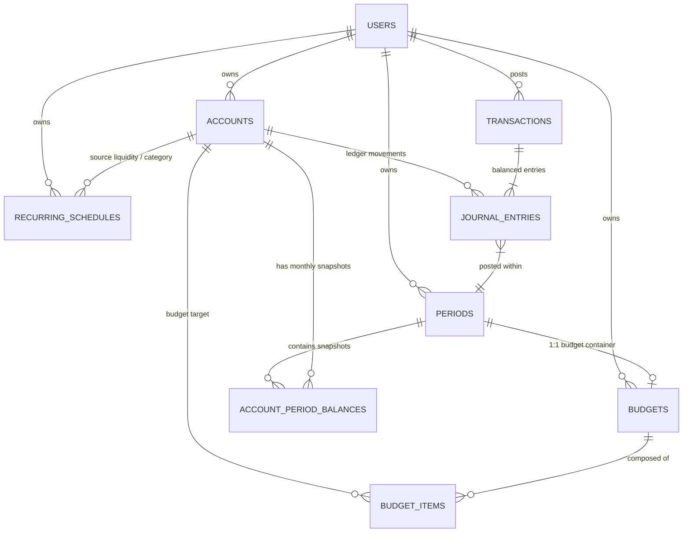
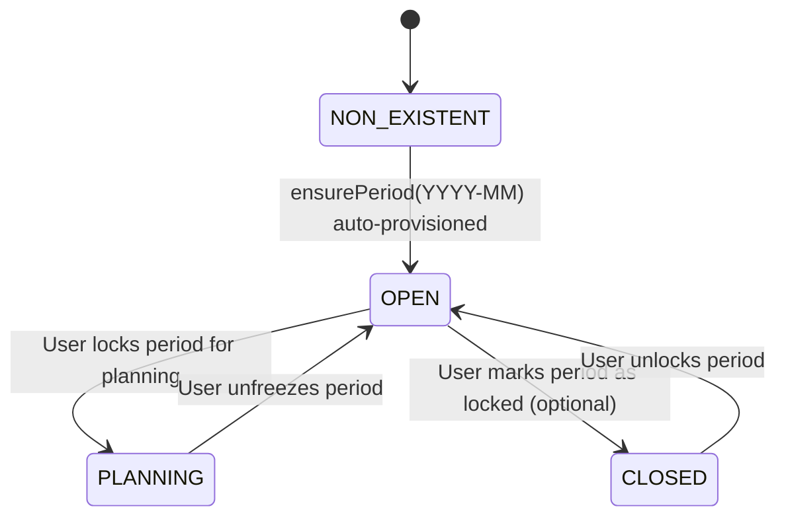
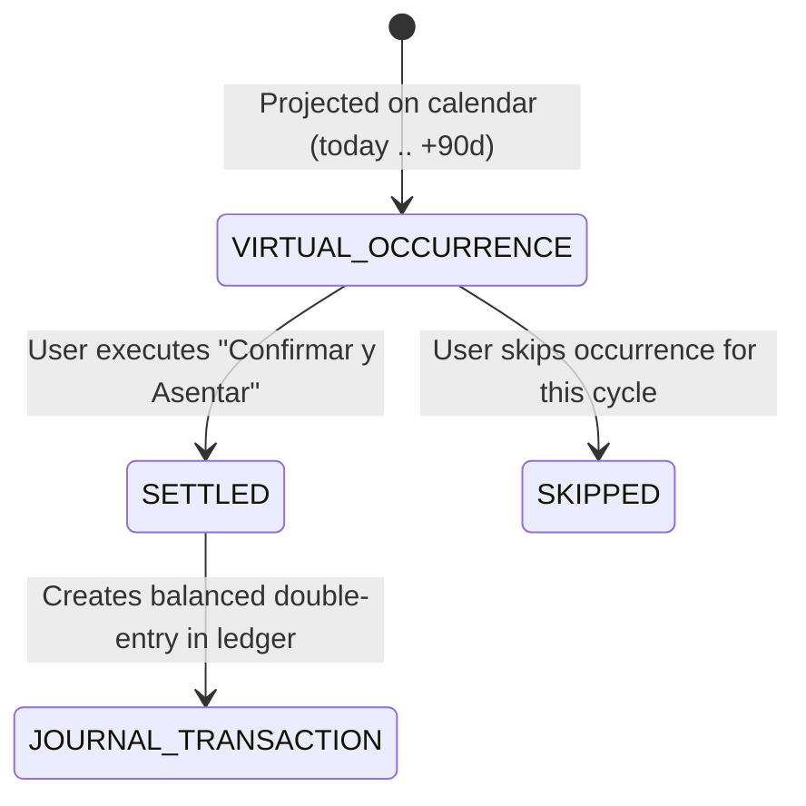

# Phase 1 Data Model: Personal Wealth Hub & Continuous Financial Forecasting

**Feature Branch**: `023-personal-wealth-hub`  
**Date**: 2026-08-27  
**Spec Reference**: `specs/023-personal-wealth-hub/spec.md`

---

## 1. Entity Relationship Diagram (ERD)



> **Elimination of Fiscal Years**: `FiscalYearEntity` is completely eliminated from the architecture. Monthly periods are first-class citizens owned directly by `UserEntity`.

---

## 2. Entities & Schemas

### 2.1 `PeriodEntity` (Refactored)

Represents an atomic calendar monthly bucket (`YYYY-MM`). Owned directly by the user/tenant context without any fiscal year wrapper.

| Field        | Type          | Modifiers                                    | Description                                          |
| :----------- | :------------ | :------------------------------------------- | :--------------------------------------------------- |
| `id`         | `uuid`        | PK, default `uuid_generate_v4()`             | Unique identifier                                    |
| `user_id`    | `uuid`        | FK (`users.id`), NOT NULL, ON DELETE CASCADE | Tenant/user owner                                    |
| `name`       | `varchar(7)`  | NOT NULL                                     | Format `YYYY-MM` (e.g. "2026-08")                    |
| `start_date` | `date`        | NOT NULL                                     | Format `YYYY-MM-01`                                  |
| `end_date`   | `date`        | NOT NULL                                     | Format `YYYY-MM-28..31` (last calendar day of month) |
| `status`     | `varchar(10)` | NOT NULL, DEFAULT `'OPEN'`                   | `'OPEN'`, `'CLOSED'`, or `'PLANNING'`                |

**Database Constraints & Indexes**:

- `@Index(['userId', 'name'], { unique: true })`: Uniqueness constraint per user and monthly period name.
- `@Index(['userId', 'startDate'])`: Fast chronological retrieval.

**Validation Invariants**:

- `name` matches regex `^\d{4}-(0[1-9]|1[0-2])$`.
- `startDate` is day 1 of the month (`YYYY-MM-01`).
- `endDate` is the true last day of that month (handling leap years: Feb 28 vs 29, Apr/Jun/Sep/Nov 30, Jan/Mar/May/Jul/Aug/Oct/Dec 31).

---

### 2.2 `AccountPeriodBalanceEntity` (Pre-Aggregated Snapshots)

Pre-aggregated balance snapshot for an account within a monthly period. The authoritative caching layer for instant reports (Balance General, Net Worth, Cash Flow).

| Field             | Type            | Modifiers                                       | Description                          |
| :---------------- | :-------------- | :---------------------------------------------- | :----------------------------------- |
| `id`              | `uuid`          | PK, default `uuid_generate_v4()`                | Unique snapshot ID                   |
| `account_id`      | `uuid`          | FK (`accounts.id`), NOT NULL, ON DELETE CASCADE | Target account                       |
| `period_id`       | `uuid`          | FK (`periods.id`), NOT NULL, ON DELETE CASCADE  | Target monthly period                |
| `opening_balance` | `decimal(18,4)` | NOT NULL, DEFAULT `0.0000`                      | Balance at start of month            |
| `total_debits`    | `decimal(18,4)` | NOT NULL, DEFAULT `0.0000`                      | Sum of base debit entries in period  |
| `total_credits`   | `decimal(18,4)` | NOT NULL, DEFAULT `0.0000`                      | Sum of base credit entries in period |
| `closing_balance` | `decimal(18,4)` | NOT NULL, DEFAULT `0.0000`                      | Balance at end of month              |
| `last_updated`    | `timestamptz`   | NOT NULL, auto-updated                          | Audit timestamp                      |

**Database Constraints & Indexes**:

- `@Index(['accountId', 'periodId'], { unique: true })`: Unique snapshot per account and period.
- `@Index(['periodId'])`: Period-level queries for Balance Sheet and Net Worth.

**Balance Calculation Rules**:

- For Normal Debit Accounts (`ASSET`, `EXPENSE`):
  $$\text{closingBalance} = \text{openingBalance} + \text{totalDebits} - \text{totalCredits}$$
- For Normal Credit Accounts (`LIABILITY`, `EQUITY`, `INCOME`):
  $$\text{closingBalance} = \text{openingBalance} + \text{totalCredits} - \text{totalDebits}$$
- **Continuous Roll-Forward Rule**:
  For Balance Accounts (`ASSET`, `LIABILITY`, `EQUITY`):
  $$\text{openingBalance}(M) = \text{closingBalance}(M-1)$$
  For P&L Accounts (`INCOME`, `EXPENSE`):
  $$\text{openingBalance}(M) = 0.0000$$

---

### 2.3 `BudgetEntity` & `BudgetItemEntity`

Stores user-defined monthly projections across the 4 financial quadrants.

#### `BudgetEntity`

| Field        | Type          | Modifiers                                              | Description                        |
| :----------- | :------------ | :----------------------------------------------------- | :--------------------------------- |
| `id`         | `uuid`        | PK                                                     | Unique budget container ID         |
| `user_id`    | `uuid`        | FK (`users.id`), NOT NULL                              | Owner                              |
| `period_id`  | `uuid`        | FK (`periods.id`), NOT NULL, UNIQUE, ON DELETE CASCADE | Target monthly period (1:1)        |
| `name`       | `varchar`     | NOT NULL                                               | Label (e.g. "Presupuesto 2026-08") |
| `created_at` | `timestamptz` | NOT NULL, auto-created                                 | Creation timestamp                 |
| `updated_at` | `timestamptz` | NOT NULL, auto-updated                                 | Modification timestamp             |

#### `BudgetItemEntity`

| Field                 | Type            | Modifiers                                       | Description                                            |
| :-------------------- | :-------------- | :---------------------------------------------- | :----------------------------------------------------- |
| `id`                  | `uuid`          | PK                                              | Unique item ID                                         |
| `budget_id`           | `uuid`          | FK (`budgets.id`), NOT NULL, ON DELETE CASCADE  | Parent budget                                          |
| `account_id`          | `uuid`          | FK (`accounts.id`), NOT NULL, ON DELETE CASCADE | Associated account                                     |
| `sub_row_id`          | `varchar`       | NULLABLE                                        | Sub-category ID                                        |
| `sub_row_label`       | `varchar`       | NULLABLE                                        | Sub-category label                                     |
| `amount`              | `decimal(18,4)` | NOT NULL, DEFAULT `0.0000`                      | Budgeted amount                                        |
| `cash_flow_direction` | `varchar`       | NULLABLE                                        | `'INGRESO_EFECTIVO'` or `'EGRESO_EFECTIVO'`            |
| `flow_intention`      | `varchar`       | NULLABLE                                        | `'PAY'`, `'RECEIVE'`, `'INVEST'`, `'SAVE'`, `'DIVEST'` |

**Classification into 4 Quadrants**:

1. **`INGRESOS`**: `account.type == 'INCOME'` or `cash_flow_direction == 'INGRESO_EFECTIVO'`.
2. **`EGRESOS`**: `account.type == 'EXPENSE'` or (`cash_flow_direction == 'EGRESO_EFECTIVO'` and `account.type == 'EXPENSE'`).
3. **`AHORRO_INVERSIONES`**: `account.type == 'ASSET'` (excluding liquid cash/bank) or `EQUITY`, or `flow_intention IN ('INVEST', 'SAVE')`.
4. **`DEUDAS_FINANCIACION`**: `account.type == 'LIABILITY'`, or `flow_intention == 'PAY'`.

---

### 2.4 `RecurringScheduleEntity` (Tactical Commitments)

Stores recurring inflow/outflow rules for 30–90 day cash flow preview without polluting the ledger.

| Field              | Type            | Modifiers                                    | Description                             |
| :----------------- | :-------------- | :------------------------------------------- | :-------------------------------------- |
| `id`               | `uuid`          | PK, default `uuid_generate_v4()`             | Unique schedule ID                      |
| `user_id`          | `uuid`          | FK (`users.id`), NOT NULL, ON DELETE CASCADE | Owner                                   |
| `name`             | `varchar(100)`  | NOT NULL                                     | Description (e.g. "Alquiler Depto")     |
| `flow_type`        | `varchar(10)`   | NOT NULL                                     | `'INFLOW'` or `'OUTFLOW'`               |
| `estimated_amount` | `decimal(18,4)` | NOT NULL                                     | Anticipated amount                      |
| `frequency`        | `varchar(15)`   | NOT NULL, DEFAULT `'MONTHLY'`                | `'MONTHLY'`, `'BIWEEKLY'`, `'ANNUALLY'` |
| `due_day`          | `int`           | NOT NULL                                     | Day of month (1 to 31)                  |
| `account_id`       | `uuid`          | FK (`accounts.id`), NOT NULL                 | Cash/Bank liquidity account             |
| `category_id`      | `uuid`          | FK (`accounts.id`), NOT NULL                 | Income/Expense category account         |
| `is_active`        | `boolean`       | NOT NULL, DEFAULT `true`                     | Active status                           |
| `metadata`         | `jsonb`         | NULLABLE                                     | Settings, tags                          |
| `created_at`       | `timestamptz`   | NOT NULL, auto-created                       | Creation timestamp                      |
| `updated_at`       | `timestamptz`   | NOT NULL, auto-updated                       | Update timestamp                        |

**Database Constraints & Indexes**:

- `@Index(['userId', 'isActive'])`: Fast retrieval of active user commitments.
- `@Index(['userId', 'dueDay'])`: Efficient calendar filtering.
- Check constraint: `due_day >= 1 AND due_day <= 31`.
- Check constraint: `estimated_amount > 0`.

---

## 3. State Transitions & Lifecycles

### 3.1 Monthly Period Lifecycle



- **Default State**: Automatically provisioned periods are always created in `'OPEN'` state.
- **Continuous Modification**: In the personal wealth hub, past and future periods remain accessible and editable; changes cascade automatically forward.

### 3.2 Recurring Commitment Lifecycle



- **Virtual Occurrence**: Does not write to `transactions` or `journal_entries`. Exists strictly as a projected calendar event.
- **Settlement**: When confirmed, writes an immutable, balanced transaction into the ledger and updates `AccountPeriodBalanceEntity`.

---

## 4. Cash Flow & Net Worth Computation Schemas

### 4.1 Rolling Cash Flow Mathematical Engine

```typescript
export interface RollingCashFlowSummary {
  // Q1: Operating Cash Inflows
  totalInflows: Record<string, number> & { total: number };

  // Q2: Operating Expenses (Egresos)
  operatingExpenses: Record<string, number> & { total: number };

  // Operating Surplus: Q1 - Q2
  operatingSurplus: Record<string, number> & { total: number };

  // Q3: Wealth Accumulation (Investments & Savings transfers)
  investmentsAndSavings: Record<string, number> & { total: number };

  // Q4: Debt & Financing Service (Principal repayments)
  debtFinancing: Record<string, number> & { total: number };

  // Net Cash Flow: Operating Surplus - Q3 - Q4
  netCashFlow: Record<string, number> & { total: number };

  // Bank Liquidity Roll-Forward
  openingCash: Record<string, number>;
  closingCash: Record<string, number>;

  // Liquidity Shortfall Alerts
  shortfallAlerts: Record<string, { isNegative: boolean; shortfall: number }>;
}
```

### 4.2 Net Worth Snapshot Point

```typescript
export interface NetWorthEvolutionPoint {
  period: string; // "YYYY-MM"
  date: string; // "YYYY-MM-DD"
  assets: number; // Sum of closing balances of ASSET accounts
  liabilities: number; // Sum of closing balances of LIABILITY accounts
  netWorth: number; // Assets - Liabilities
}
```

---

## 5. Eliminated Entities & Clean Break

The following legacy entities and files are scheduled for deletion:

- `backend/src/infrastructure/database/entities/fiscal-year.entity.ts`: **DELETED**
- `backend/src/application/periods/create-fiscal-year.use-case.ts`: **DELETED**
- `backend/src/application/periods/close-fiscal-year.use-case.ts`: **DELETED**
- `backend/src/infrastructure/controllers/dto/create-fiscal-year.dto.ts`: **DELETED**
- `shared/src`: Remove `CreateFiscalYearRequestSchema`, `CloseFiscalYearRequestSchema`, and all `fiscalYearId` fields from matrix DTOs.
