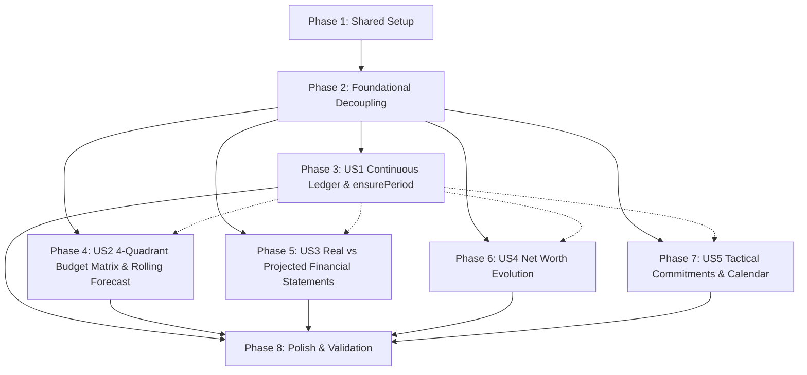

# Tasks: Personal Wealth Hub & Continuous Financial Forecasting

**Input**: Design documents from `/specs/023-personal-wealth-hub/` (`spec.md`, `plan.md`, `research.md`, `data-model.md`, `contracts/wealth-hub.contract.md`, `quickstart.md`)  
**Constitution**: `.specify/memory/constitution.md` (Principle V: Strict TDD, Principle I: Ledger Integrity, Principle VII: ESLint Compliance)  
**Organization**: Tasks are grouped by user story to enable independent implementation and testing of each story.

## Format: `- [ ] [TaskID] [P?] [Story?] Description with file path`

- **[P]**: Can run in parallel (different files, no dependencies on incomplete tasks)
- **[Story]**: Which user story this task belongs to (`[US1]`, `[US2]`, `[US3]`, `[US4]`, `[US5]`)
- Every task includes exact file paths in descriptions

---

## Phase 1: Setup (Shared Infrastructure)

**Purpose**: Centralize contracts, Zod schemas, TypeScript types, and enums in `@sistema-contable/shared` as single source of truth, removing all legacy `FiscalYear` schemas.

- [x] T001 Update shared package to remove `FiscalYear` schemas/types and add `EnsurePeriodRequestSchema` and `EnsurePeriodResponse` in `shared/src/index.ts`
- [x] T002 [P] Update shared package to add rolling budget matrix and cash flow schemas (`RollingBudgetMatrixResponse`, `RollingCashFlowSummary`, `BatchUpdateBudgetMatrixRequestSchema`, `ExtendBudgetMatrixRequestSchema`, `ExtendBudgetMatrixResponse`) in `shared/src/index.ts`
- [x] T003 [P] Update shared package to add recurring schedule and net worth schemas (`RecurringScheduleDto`, `CreateRecurringScheduleRequestSchema`, `UpdateRecurringScheduleRequestSchema`, `CalendarPreviewResponse`, `SettleRecurringScheduleRequestSchema`, `NetWorthEvolutionPoint`, `NetWorthEvolutionResponse`) in `shared/src/index.ts`
- [x] T004 Compile shared package and verify types with `npm run build --workspace=@sistema-contable/shared`

---

## Phase 2: Foundational (Blocking Prerequisites)

**Purpose**: Core architectural refactoring to eliminate `FiscalYearEntity` completely from backend entities, models, database configuration, and frontend API services.

**⚠️ CRITICAL**: No user story work can begin until this phase is complete.

- [x] T005 Delete legacy fiscal year backend files (`backend/src/infrastructure/database/entities/fiscal-year.entity.ts`, `backend/src/application/periods/create-fiscal-year.use-case.ts`, `backend/src/application/periods/close-fiscal-year.use-case.ts`, `backend/src/infrastructure/controllers/dto/create-fiscal-year.dto.ts`)
- [x] T006 Refactor `PeriodEntity` in `backend/src/infrastructure/database/entities/period.entity.ts` to remove `fiscalYearId` and relation, add direct `userId` ownership, and update compound index to `[userId, name]`
- [x] T007 Refactor `Period` domain model in `backend/src/domain/ledger/period.model.ts` to decouple from fiscal years and represent monthly calendar periods (`YYYY-MM`, start/end dates, user ownership)
- [x] T008 [P] Update TypeORM database configuration and module imports in `backend/src/infrastructure/database/database.module.ts` and `backend/src/app.module.ts` to remove `FiscalYearEntity`
- [x] T008b [US1] Create TypeORM migration `1785900000000-EliminateFiscalYearsAndScopePeriodsToUser.ts` in `backend/src/infrastructure/database/migrations/` to drop `fiscal_years` table, remove `fiscal_year_id` from `periods`, and add `user_id` foreign key and composite indexes
- [x] T009 [P] Update frontend API service in `frontend/src/services/api.ts` to remove `fiscalYears` namespace and align period endpoints with user-scoped `/api/periods`

**Checkpoint**: Foundation ready — monthly period schema and shared contracts established; user story implementation can now proceed.

---

## Phase 3: User Story 1 - Continuous Monthly Ledger & Auto-Provisioned Periods (Priority: P1) 🎯 MVP

**Goal**: Allow users to record monetary transactions on any date (past, present, or future) without encountering fiscal year boundary errors or period-closed blocks, auto-provisioning monthly periods (`YYYY-MM`) and cascading account balance adjustments forward chronologically.

**Independent Test**: Post a journal transaction to an uncreated future month (e.g. `2027-04-15`) and uncreated past month, verifying `PeriodEntity` rows are auto-provisioned atomically, `AccountPeriodBalanceEntity` snapshots inherit closing balances from preceding months, and retroactive edits propagate changes through subsequent periods.

### Tests for User Story 1 (Strict TDD - Write and ensure FAIL first) ⚠️

- [x] T010 [P] [US1] Unit and integration tests for `EnsurePeriodService` auto-provisioning and continuous gap filling in `backend/tests/integration/period-creation.spec.ts`
- [x] T011 [P] [US1] Integration tests for forward balance cascade across chronological `AccountPeriodBalanceEntity` snapshots in `backend/tests/integration/balance-propagation.spec.ts`
- [x] T012 [P] [US1] Integration tests for unconstrained transaction posting across past and future dates without boundary errors in `backend/tests/integration/ledger-validation.spec.ts`

### Implementation for User Story 1

- [x] T013 [US1] Implement `EnsurePeriodService` in `backend/src/application/periods/ensure-period.service.ts` with atomic get-or-create, month normalization, gap filling, and initial snapshot generation
- [x] T014 [US1] Refactor `BalanceUpdateService` in `backend/src/application/periods/balance-update.service.ts` to eliminate fiscal year joins and implement continuous forward balance cascade across subsequent `AccountPeriodBalanceEntity` snapshots
- [x] T015 [US1] Update `CreateTransactionUseCase` in `backend/src/application/ledger/create-transaction.use-case.ts` to invoke `EnsurePeriodService` and auto-provision periods upon transaction posting
- [x] T016 [US1] Refactor `PeriodController` in `backend/src/infrastructure/controllers/period.controller.ts` to expose `POST /api/periods/ensure`, `GET /api/periods`, and eliminate fiscal year routes
- [x] T017 [US1] Refactor periods management view in `frontend/src/app/periods/page.tsx` to remove annual fiscal year closing wizards and provide continuous monthly status overview

**Checkpoint**: At this point, User Story 1 is fully functional and testable independently (MVP deliverable).

---

## Phase 4: User Story 2 - Four-Quadrant Budget Matrix & Rolling Cash Flow Forecast (Priority: P1)

**Goal**: Budget monthly financial flows across four distinct cash quadrants (`INGRESOS`, `EGRESOS`, `AHORRO_INVERSIONES`, `DEUDAS_FINANCIACION`) in a rolling 12-to-24 month window, projecting continuous liquidity and bank balances with negative cash warnings.

**Independent Test**: Enter figures across all 4 quadrants in a 12-month rolling window and verify Operating Surplus, Net Cash Flow ($\Delta \text{Efectivo}$), and Projected Closing Cash balance reflect operational expenses, investments, and debt payments, and navigate across year boundaries seamlessly.

### Tests for User Story 2 (Strict TDD - Write and ensure FAIL first) ⚠️

- [x] T018 [P] [US2] Unit tests for four-quadrant categorization, Operating Surplus, and rolling liquidity mathematical engine in `backend/tests/unit/cash-flow-forecast.spec.ts`
- [x] T019 [P] [US2] Integration tests for rolling budget matrix retrieval across year boundaries in `backend/tests/integration/budget-matrix.spec.ts`
- [x] T020 [P] [US2] Integration tests for matrix batch cell updates and dynamic timeline extension in `backend/tests/integration/budget-replication.spec.ts`

### Implementation for User Story 2

- [x] T021 [US2] Implement `GetBudgetMatrixUseCase` in `backend/src/application/budgets/get-budget-matrix.use-case.ts` supporting `(startPeriod, months)` rolling window, 4-quadrant grouping, and cash flow liquidity roll-forward
- [x] T022 [US2] Implement `UpdateBudgetMatrixUseCase` in `backend/src/application/budgets/update-budget-matrix.use-case.ts` for cell batch updates without `fiscalYearId`
- [x] T023 [US2] Implement `ExtendBudgetMatrixUseCase` in `backend/src/application/budgets/extend-budget-matrix.use-case.ts` for dynamic month provisioning and optional previous month cloning
- [x] T024 [US2] Update `BudgetController` in `backend/src/infrastructure/controllers/budget.controller.ts` to expose `GET /api/budgets/matrix`, `PUT /api/budgets/matrix/batch-update`, and `POST /api/budgets/matrix/extend`
- [x] T025 [US2] Refactor `BudgetMobileView.tsx` in `frontend/src/components/budgets/BudgetMobileView.tsx` with 4-quadrant accordion grouping and executive KPI summary bar
- [x] T026 [US2] Refactor `BudgetMatrixGrid.tsx` in `frontend/src/components/budgets/BudgetMatrixGrid.tsx` for continuous rolling matrix navigation across months
- [x] T027 [US2] Refactor matrix page in `frontend/src/app/budgets/matrix/page.tsx` to remove fiscal year selectors and provide continuous rolling navigation (1M, 4M, 6M, 12M) with dynamic Hero KPI metrics

**Checkpoint**: At this point, User Stories 1 AND 2 are both functional and testable independently.

---

## Phase 5: User Story 3 - Real vs Projected Financial Statements (Balance Sheet, P&L, Cash Flow) (Priority: P2)

**Goal**: Generate Balance General, Estado de Resultados (P&L), and Flujo de Caja across any selected monthly periods in both Real and Projected modes, with side-by-side budget execution variance control.

**Independent Test**: Run Balance General, Estado de Resultados, and Flujo de Caja for historical months (actual ledger totals) and future months (budget projections), verifying totals match `AccountPeriodBalanceEntity` and `BudgetItemEntity` records.

### Tests for User Story 3 (Strict TDD - Write and ensure FAIL first) ⚠️

- [x] T028 [P] [US3] Unit and integration tests for instant Balance General from snapshots in `backend/tests/integration/fast-reports.spec.ts`
- [x] T029 [P] [US3] Unit tests for Real Cash Flow Statement in `backend/src/application/reports/get-cash-flow.use-case.spec.ts`
- [x] T030 [P] [US3] Unit tests for Projected Estado de Resultados and budget variance control in `backend/tests/unit/budget-control.spec.ts`

### Implementation for User Story 3

- [x] T031 [US3] Refactor `BalanceSheetUseCase` in `backend/src/application/periods/balance-sheet.use-case.ts` to query `AccountPeriodBalanceEntity` directly by user and monthly period/date range, computing Net Worth directly as Total Assets - Total Liabilities without synthetic corporate equity tree injections
- [x] T032 [US3] Implement `CashFlowStatementUseCase` in `backend/src/application/reports/cash-flow-statement.use-case.ts` for actual historical cash movements across operational, investing, and financing categories
- [x] T033 [US3] Refactor Income Statement use case in `backend/src/application/periods/income-statement.use-case.ts` to support Real and Projected modes by period
- [x] T034 [US3] Update `ReportsController` in `backend/src/infrastructure/controllers/reports.controller.ts` for balance sheet, cash flow, and income statement endpoints
- [x] T035 [P] [US3] Refactor Balance Sheet and Cash Flow pages in `frontend/src/app/reports/balance-sheet/page.tsx` and `frontend/src/app/reports/cash-flow/page.tsx` for streamlined executive presentation (Total Assets, Total Liabilities, Net Worth) and monthly period selectors without fiscal year constraints
- [x] T036 [P] [US3] Refactor Forecast and Budget Control pages in `frontend/src/app/reports/forecast/page.tsx` and `frontend/src/app/budgets/control/page.tsx` to consume rolling matrix and budget execution data

**Checkpoint**: At this point, User Stories 1, 2, and 3 are all independently testable and operational.

---

## Phase 6: User Story 4 - Historical Net Worth Evolution (Priority: P2)

**Goal**: Provide a continuous historical chart of Net Worth ($\sum \text{Assets} - \sum \text{Liabilities}$) over time, executing in under 50ms p95 across 36+ periods from pre-aggregated balance snapshots.

**Independent Test**: Request `/api/reports/net-worth-evolution` across multi-year history, verifying response latency is $<50$ms and values correspond exactly to each monthly period's closing snapshot.

### Tests for User Story 4 (Strict TDD - Write and ensure FAIL first) ⚠️

- [x] T037 [P] [US4] Integration tests for high-speed Net Worth Evolution query ($<50$ms p95) in `backend/tests/integration/net-worth-evolution.spec.ts`
- [x] T038 [P] [US4] Component test for `NetWorthChart.tsx` in `frontend/src/tests/NetWorthChart.test.tsx`

### Implementation for User Story 4

- [x] T039 [US4] Implement `NetWorthEvolutionUseCase` in `backend/src/application/reports/net-worth-evolution.use-case.ts` executing aggregated snapshot query
- [x] T040 [US4] Expose `GET /api/reports/net-worth-evolution` in `backend/src/infrastructure/controllers/reports.controller.ts`
- [x] T041 [US4] Implement `NetWorthChart.tsx` in `frontend/src/components/stats/NetWorthChart.tsx` with tabular numbers and responsive styling
- [x] T042 [US4] Connect stats page in `frontend/src/app/stats/page.tsx` to the net worth evolution endpoint

**Checkpoint**: At this point, User Stories 1 through 4 are fully functional.

---

## Phase 7: User Story 5 - Tactical Short-Term Commitments & Calendar Preview (Priority: P3)

**Goal**: Track recurring scheduled commitments (rent, salaries, subscriptions, debt dues) in a 30-to-90-day virtual calendar view without polluting the ledger with speculative entries, and execute one-click double-entry settlement.

**Independent Test**: Define recurring commitment rules, view upcoming 60-day calendar preview of virtual inflows and outflows, and confirm a due commitment to automatically generate a balanced ledger entry and update account period balances.

### Tests for User Story 5 (Strict TDD - Write and ensure FAIL first) ⚠️

- [ ] T043 [P] [US5] Unit and integration tests for `RecurringSchedule` CRUD and virtual 30-90 day calendar projection in `backend/tests/integration/recurring-schedule.spec.ts`
- [ ] T044 [P] [US5] Integration tests for one-click double-entry settlement into ledger in `backend/tests/integration/recurring-schedule-settle.spec.ts`
- [ ] T045 [P] [US5] Frontend component test for commitment calendar preview and modal in `frontend/src/tests/CommitmentCalendarPreview.test.tsx`

### Implementation for User Story 5

- [ ] T046 [P] [US5] Create `RecurringScheduleEntity` in `backend/src/infrastructure/database/entities/recurring-schedule.entity.ts` with check constraints on `dueDay` and `estimatedAmount`
- [ ] T046b [US5] Create TypeORM migration for `recurring_schedules` table with foreign keys, check constraints, and composite indexes in `backend/src/infrastructure/database/migrations/`
- [ ] T047 [P] [US5] Create `RecurringSchedule` domain model in `backend/src/domain/commitments/recurring-schedule.model.ts`
- [ ] T048 [US5] Implement `CreateRecurringScheduleUseCase` and CRUD in `backend/src/application/commitments/create-recurring-schedule.use-case.ts`
- [ ] T049 [US5] Implement `GetCalendarPreviewUseCase` in `backend/src/application/commitments/get-calendar-preview.use-case.ts` (virtual projection engine with zero ledger pollution)
- [ ] T050 [US5] Implement `SettleRecurringScheduleUseCase` in `backend/src/application/commitments/settle-recurring-schedule.use-case.ts` (creates balanced double-entry transaction and updates balances)
- [ ] T051 [US5] Create `RecurringScheduleController` in `backend/src/infrastructure/controllers/recurring-schedule.controller.ts`
- [ ] T052 [P] [US5] Implement `CommitmentCalendarPreview.tsx` and `CommitmentModal.tsx` in `frontend/src/components/commitments/`
- [ ] T053 [US5] Create dedicated tactical commitments page in `frontend/src/app/budgets/commitments/page.tsx`

**Checkpoint**: All user stories are now independently functional and integrated.

---

## Phase 8: Polish & Cross-Cutting Concerns

**Purpose**: Cleanup, UI ergonomics verification, and comprehensive quality gate validation.

- [ ] T054 [P] Clean up deleted test file `backend/tests/integration/annual-closing.spec.ts` and remove any lingering `fiscalYearId` references across remaining tests
- [ ] T055 [P] Update navigation menus in `frontend/src/components/Sidebar.tsx` and `frontend/src/components/BottomNav.tsx` to link to commitments and remove annual closing references
- [ ] T056 Execute comprehensive end-to-end validation scenarios described in `specs/023-personal-wealth-hub/quickstart.md`
- [ ] T057 Run full monorepo quality gates (`npm run validate` which executes `npm run type-check && npm run lint && npm test`) ensuring 0 errors, 0 warnings

---

## Dependencies & Execution Order

### Phase Dependencies

- **Phase 1 (Setup)**: No dependencies — executes immediately.
- **Phase 2 (Foundational)**: Depends on Phase 1 completion — BLOCKS all user stories.
- **Phase 3 (User Story 1 - P1)**: Depends on Phase 2 completion. Forms MVP.
- **Phase 4 (User Story 2 - P1)**: Depends on Phase 2 completion; integrates with `EnsurePeriodService` from Phase 3.
- **Phase 5 (User Story 3 - P2)**: Depends on Phase 2 completion; consumes `AccountPeriodBalanceEntity` from Phase 3.
- **Phase 6 (User Story 4 - P2)**: Depends on Phase 2 completion; queries snapshots established in Phase 3.
- **Phase 7 (User Story 5 - P3)**: Depends on Phase 2 completion; settlement invokes `BalanceUpdateService` from Phase 3.
- **Phase 8 (Polish)**: Depends on completion of all user story phases.

### User Story Dependencies



### Within Each User Story

1. Tests MUST be written FIRST and fail before implementation (Constitution Principle V).
2. Domain entities/models before services and use cases.
3. Services and use cases before controllers and endpoints.
4. Core business logic before UI components and pages.
5. Story verified independently before marking phase complete.

### Parallel Opportunities

- **Phase 1**: T002 and T003 can run in parallel after T001.
- **Phase 2**: T008 and T009 can run in parallel after T005, T006, and T007.
- **Phase 3**: Tests T010, T011, and T012 can run in parallel.
- **Phase 4**: Tests T018, T019, T020 can run in parallel. Frontend components T025 and T026 can run in parallel with backend tasks.
- **Phase 5**: Tests T028, T029, T030 can run in parallel. Frontend views T035 and T036 can run in parallel with backend endpoints.
- **Phase 6**: Test T037 and component test T038 can run in parallel.
- **Phase 7**: Tests T043, T044, T045 can run in parallel. Entity T046 and model T047 can run in parallel. UI components T052 can run in parallel with use cases.
- **Phase 8**: T054 and T055 can run in parallel.

---

## Parallel Example: User Story 1

```bash
# Launch all test tasks for User Story 1 concurrently:
Task T010: "Unit and integration tests for EnsurePeriodService auto-provisioning in backend/tests/integration/period-creation.spec.ts"
Task T011: "Integration tests for forward balance cascade in backend/tests/integration/balance-propagation.spec.ts"
Task T012: "Integration tests for unconstrained transaction posting in backend/tests/integration/ledger-validation.spec.ts"
```

## Parallel Example: User Story 2

```bash
# Launch tests concurrently:
Task T018: "Unit tests for four-quadrant categorization in backend/tests/unit/cash-flow-forecast.spec.ts"
Task T019: "Integration tests for rolling budget matrix in backend/tests/integration/budget-matrix.spec.ts"
Task T020: "Integration tests for matrix batch cell updates in backend/tests/integration/budget-replication.spec.ts"
```

---

## Implementation Strategy

### MVP First (User Story 1 Only)

1. Complete **Phase 1: Setup** (Shared Zod schemas and TypeScript types).
2. Complete **Phase 2: Foundational** (Delete `FiscalYearEntity`, update `PeriodEntity` with `userId`).
3. Complete **Phase 3: User Story 1** (`ensurePeriod` service, balance cascade forward, unconstrained transaction posting).
4. **STOP and VALIDATE**: Verify that transactions post to any past/future month without boundary errors.
5. Deliverable: Working continuous temporal foundation without fiscal year lockouts (MVP).

### Incremental Delivery

1. **Sprint 1 (MVP)**: Setup + Foundational + User Story 1 (Continuous Ledger & Auto-provisioning).
2. **Sprint 2**: User Story 2 (Four-Quadrant Budget Matrix & Rolling 12-Month Cash Flow Forecast).
3. **Sprint 3**: User Story 3 & 4 (Real vs Projected Financial Statements & High-Speed Net Worth Evolution).
4. **Sprint 4**: User Story 5 & Polish (Tactical Short-Term Commitments, Calendar Preview, Quality Gates).

### Parallel Team Strategy

With multiple developers:

1. Team executes Phase 1 & Phase 2 together.
2. Once Phase 2 is complete:
   - **Developer A**: User Story 1 (Core temporal engine & balance cascade)
   - **Developer B**: User Story 2 (Budget matrix & rolling forecast)
   - **Developer C**: User Story 5 (Tactical commitments & calendar preview)
3. Developer A transitions to User Story 3 & 4 after User Story 1 is verified.
4. All merge into Phase 8 for comprehensive `npm run validate`.
